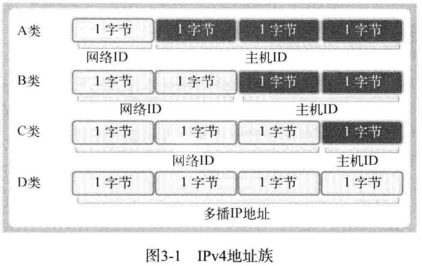
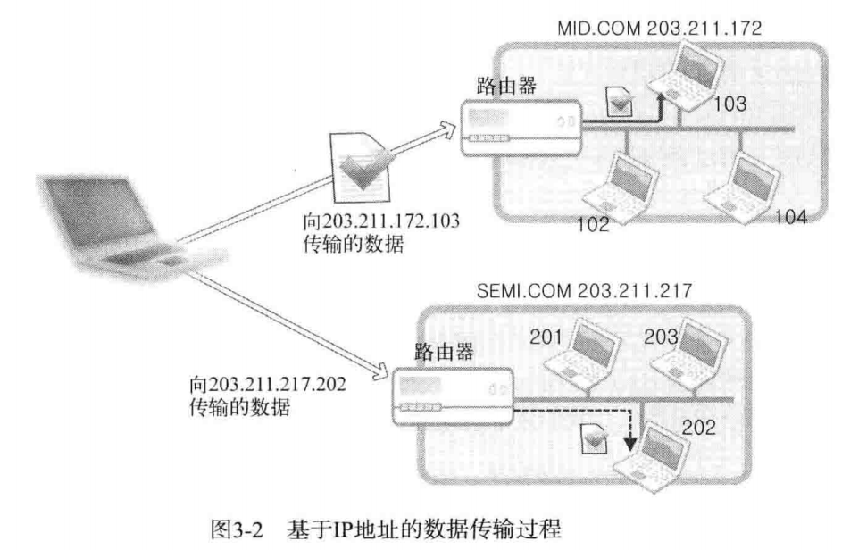
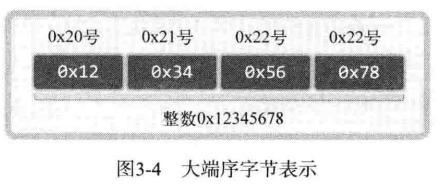
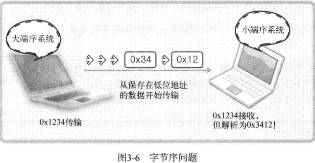

## 第 3 章 地址族与数据序列

把套接字比喻成电话，那么目前只安装了电话机，本章讲解给电话机分配号码的方法，即给套接字分配 IP 地址和端口号。

### 3.1 分配给套接字的 IP 地址与端口号

IP 是 Internet Protocol（网络协议）的简写，是为收发网络数据而分配给计算机的值。端口号并非赋予计算机的值，而是为了区分程序中创建的套接字而分配给套接字的序号。

#### 3.1.1 网络地址（Internet Address）

为使计算机连接到网络并收发数据，必须为其分配 IP 地址。IP 地址分为两类。

- IPV4（Internet Protocol version 4）4 字节地址族
- IPV6（Internet Protocol version 6）16 字节地址族

两者之间的主要差别是 IP 地址所用的字节数，目前通用的是 IPV4 , IPV6 的普及还需要时间。

IPV4 标准的 4 字节 IP 地址分为网络地址和主机（指计算机）地址，且分为 A、B、C、D、E 等类型。



数据传输过程：



某主机向 203.211.172.103 和 203.211.217.202 传递数据，其中 203.211.172 和 203.211.217 为该网络的网络地址，所以「向相应网络传输数据」实际上是向构成网络的路由器或者交换机传输数据，然后由路由器或者交换机根据数据中的主机地址向目标主机传递数据。

#### 3.1.2 网络地址分类与主机地址边界

只需通过IP地址的第一个字节即可判断网络地址占用的总字节数，因为我们根据IP地址的边界区分网络地址，如下所示：

- A 类地址的首字节范围为：0~127
- B 类地址的首字节范围为：128~191
- C 类地址的首字节范围为：192~223

还有如下这种表示方式：

- A 类地址的首位以 0 开始
- B 类地址的前2位以 10 开始
- C 类地址的前3位以 110 开始

因此套接字收发数据时，数据传到网络后即可轻松找到主机。

#### 3.1.3 用于区分套接字的端口号

IP地址用于区分计算机，只要有IP地址就能向目标主机传输数据，但是只有这些还不够，我们需要把信息传输给具体的应用程序。

所以计算机一般有 NIC（网络接口卡）数据传输设备。通过 NIC 接收的数据内有端口号，操作系统参考端口号把信息传给相应的应用程序。

端口号由 16 位构成，可分配的端口号范围是 0~65535 。但是 0~1023 是知名端口，一般分配给特定的应用程序，所以应当分配给此范围之外的值。

虽然端口号不能重复，但是 TCP 套接字和 UDP 套接字不会共用端接口号，所以允许重复。如果某 TCP 套接字使用了 9190 端口号，其他 TCP 套接字就无法使用该端口号，但是 UDP 套接字可以使用。

总之，数据传输目标地址同时包含IP地址和端口号，只有这样，数据才会被传输到最终的目的应用程序。

### 3.2 地址信息的表示

应用程序中使用的IP地址和端口号以结构体的形式给出了定义。本节围绕结构体讨论目标地址的表示方法。

#### 3.2.1 表示 IPV4 地址的结构体

结构体的定义如下

```c
struct sockaddr_in
{
    sa_family_t sin_family;  // 地址族（Address Family）
    uint16_t sin_port;       // 16 位 TCP/UDP 端口号
    struct in_addr sin_addr; // 32位 IP 地址
    char sin_zero[8];        // 不使用
};
```

该结构体中提到的另一个结构体 in_addr 定义如下，它用来存放 32 位IP地址

```c
struct in_addr
{
    in_addr_t s_addr; // 32位IPV4地址
}
```

关于以上两个结构体的一些数据类型：

| 数据类型名称 |             数据类型说明             | 声明的头文件 |
| :----------: | :----------------------------------: | :----------: |
|   int 8_t    |           signed 8-bit int           | sys/types.h  |
|   uint8_t    |  unsigned 8-bit int (unsigned char)  | sys/types.h  |
|   int16_t    |          signed 16-bit int           | sys/types.h  |
|   uint16_t   | unsigned 16-bit int (unsigned short) | sys/types.h  |
|   int32_t    |          signed 32-bit int           | sys/types.h  |
|   uint32_t   | unsigned 32-bit int (unsigned long)  | sys/types.h  |
| sa_family_t  |       地址族（address family）       | sys/socket.h |
|  socklen_t   |       长度（length of struct）       | sys/socket.h |
|  in_addr_t   |       IP地址，声明为 uint_32_t       | netinet/in.h |
|  in_port_t   |       端口号，声明为 uint_16_t       | netinet/in.h |

为什么要额外定义这些数据类型呢？这是考虑扩展性的结果

#### 3.2.2 结构体 sockaddr_in 的成员分析

- 成员 sin_family

每种协议适用的地址族不同，比如，IPV4 使用 4 字节的地址族，IPV6 使用 16 字节的地址族。

> 地址族

| 地址族（Address Family） | 含义                               |
| ------------------------ | ---------------------------------- |
| AF_INET                  | IPV4用的地址族                     |
| AF_INET6                 | IPV6用的地址族                     |
| AF_LOCAL                 | 本地通信中采用的 Unix 协议的地址族 |

AF_LOACL 只是为了说明具有多种地址族而添加的。

- 成员 sin_port

  该成员保存 16 位端口号，重点在于，它以网络字节序保存。

- 成员 sin_addr

  该成员保存 32 位 IP 地址信息，且也以网络字节序保存

- 成员 sin_zero

  无特殊含义。只是为结构体 sockaddr_in 结构体变量地址值将以如下方式传递给 bind 函数。

  在之前的代码中

  ```c
  if (bind(serv_sock, (struct sockaddr *)&serv_addr, sizeof(serv_addr)) == -1)
      error_handling("bind() error");
  ```

  此处 bind 第二个参数期望得到的是 sockaddr 结构体变量的地址值，包括地址族、端口号、IP地址等。

  ```c
  struct sockaddr
  {
      sa_family_t sin_family; //地址族
      char sa_data[14];       //地址信息
  }
  ```

  此结构体 sa_data 保存的地址信息中需要包含IP地址和端口号，剩余部分应该填充 0 ，但是这样对于包含地址的信息非常麻烦，所以出现了 sockaddr_in 结构体，然后强制转换成 sockaddr 类型，则生成符合 bind 条件的参数。

### 3.3 网络字节序与地址变换

不同的 CPU 中，4 字节整数值1在内存空间保存方式是不同的。

有些 CPU 这样保存：

```
00000000 00000000 00000000 00000001
```

有些 CPU 这样保存：

```
00000001 00000000 00000000 00000000
```

两种一种是顺序保存，一种是倒序保存 。

#### 3.3.1 字节序（Order）与网络字节序

CPU 保存数据的方式有两种，这意味着 CPU 解析数据的方式也有 2 种：

- 大端序（Big Endian）：高位字节存放到低位地址
- 小端序（Little Endian）：高位字节存放到高位地址




两台字节序不同的计算机在数据传递的过程中可能出现的问题：



因为这种原因，所以在通过网络传输数据时必须约定统一的方式，这种约定被称为网络字节序（Network Byte Order），非常简单，统一为大端序。即，先把数据数组转化成大端序格式再进行网络传输。

#### 3.3.2 字节序转换

帮助转换字节序的函数：

```c
unsigned short htons(unsigned short);
unsigned short ntohs(unsigned short);
unsigned long htonl(unsigned long);
unsigned long ntohl(unsigned long);
```

通过函数名称掌握其功能，只需要了解：

- htons 的 h 代表主机（host）字节序。
- htons 的 n 代表网络（network）字节序。
- s 代表两个字节的 short 类型，因此以 s 为后缀的函数用于端口转换
- l 代表四个字节的 long 类型，所以以 l 为后缀的函数用于 IP 地址转换

下面的代码是示例，说明以上函数调用过程：

[endian_conv.c](./endian_conv.c)

```cpp
#include <stdio.h>
#include <arpa/inet.h>
int main(int argc, char *argv[])
{
    unsigned short host_port = 0x1234;
    unsigned short net_port;
    unsigned long host_addr = 0x12345678;
    unsigned long net_addr;

    net_port = htons(host_port); //转 换为网络字节序
    net_addr = htonl(host_addr);

    printf("Host ordered port: %#x \n", host_port);
    printf("Network ordered port: %#x \n", net_port);
    printf("Host ordered address: %#lx \n", host_addr);
    printf("Network ordered address: %#lx \n", net_addr);

    return 0;
}
```

编译运行：

```shell
gcc endian_conv.c -o conv
./conv
```

结果：

```
Host ordered port: 0x1234
Network ordered port: 0x3412
Host ordered address: 0x12345678
Network ordered address: 0x78563412
```

这是在小端 CPU 的运行结果。大部分人会得到相同的结果，因为 Intel 和 AMD 的 CPU 都是采用小端序为标准。

### 3.4 网络地址的初始化与分配

#### 3.4.1 将字符串信息转换为网络字节序的整数型

sockaddr_in 中需要的是 32 位整数型，但是我们只熟悉点分十进制表示法，那么该如何把类似于 201.211.214.36 转换为 4 字节的整数类型数据呢？幸运的是，有一个函数可以帮助我们完成它，该函数将字符串形式的 IP 地址转换为网络字节序形式的 32 位整数型数据。

```C
#include <arpa/inet.h>
in_addr_t inet_addr(const char *string);
//成功时返回 32 位大端序整数型值，失败时返回 INADDR_NONE
```

具体示例：

[inet_addr.c](./inet_addr.c)

```c
#include <stdio.h>
#include <arpa/inet.h>
int main(int argc, char *argv[])
{
    char *addr1 = "1.2.3.4";
    char *addr2 = "1.2.3.256";

    unsigned long conv_addr = inet_addr(addr1);
    if (conv_addr == INADDR_NONE)
        printf("Error occured! \n");
    else
        printf("Network ordered integer addr: %#lx \n", conv_addr);

    conv_addr = inet_addr(addr2);
    if (conv_addr == INADDR_NONE)
        printf("Error occured! \n");
    else
        printf("Network ordered integer addr: %#lx \n", conv_addr);
    return 0;
}
```

编译运行：

```shell
gcc inet_addr.c -o addr
./addr
```

输出：

```
Network ordered integer addr: 0x4030201
Error occured!
```

1个字节能表示的最大整数是255，所以代码中 addr2 是错误的IP地址。从运行结果看，inet_addr 不仅可以转换地址，还可以检测有效性。

inet_aton 函数与 inet_addr 函数在功能上完全相同，也是将字符串形式的IP地址转换成整数型的IP地址。只不过该函数用了 in_addr 结构体，且使用频率更高。

```c
#include <arpa/inet.h>
int inet_aton(const char *string, struct in_addr *addr);
/*
成功时返回 1 ，失败时返回 0
string: 含有需要转换的IP地址信息的字符串地址值
addr: 保存转换结果的 in_addr 结构体变量的地址值
*/
```

函数调用示例：

[inet_aton.c](./inet_aton.c)

```c
#include <stdio.h>
#include <stdlib.h>
#include <arpa/inet.h>
void error_handling(char *message);

int main(int argc, char *argv[])
{
    char *addr = "127.232.124.79";
    struct sockaddr_in addr_inet;

    if (!inet_aton(addr, &addr_inet.sin_addr))
        error_handling("Conversion error");
    else
        printf("Network ordered integer addr: %#x \n", addr_inet.sin_addr.s_addr);
    return 0;
}

void error_handling(char *message)
{
    fputs(message, stderr);
    fputc('\n', stderr);
    exit(1);
}
```

编译运行：

```c
gcc inet_aton.c -o aton
./aton
```

运行结果：

```
Network ordered integer addr: 0x4f7ce87f
```

可以看出，已经成功的把转换后的地址放进了 addr_inet.sin_addr.s_addr 中。

还有一个函数，与 inet_aton() 正好相反，它可以把网络字节序整数型IP地址转换成我们熟悉的字符串形式，函数原型如下：

```c
#include <arpa/inet.h>
char *inet_ntoa(struct in_addr adr);
//成功时返回保存转换结果的字符串地址值，失败时返回 NULL 空指针
```

该函数将通过参数传入的整数型IP地址转换为字符串格式并返回。但要小心，返回值为 char 指针，返回字符串地址意味着字符串已经保存在内存空间，但是该函数未向程序员要求分配内存，而是再内部申请了内存保存了字符串。也就是说调用了该函数后要立即把信息复制到其他内存空间。因为，若再次调用 inet_ntoa 函数，则有可能覆盖之前保存的字符串信息。总之，再次调用 inet_ntoa 函数前返回的字符串地址是有效的。若需要长期保存，则应该将字符串复制到其他内存空间。

示例：

[inet_ntoa.c](./inet_ntoa.c)

```c
#include <stdio.h>
#include <string.h>
#include <arpa/inet.h>

int main(int argc, char *argv[])
{
    struct sockaddr_in addr1, addr2;
    char *str_ptr;
    char str_arr[20];

    addr1.sin_addr.s_addr = htonl(0x1020304);
    addr2.sin_addr.s_addr = htonl(0x1010101);
    // 把 addr1 中的结构体信息转换为字符串的 IP 地址形式
    str_ptr = inet_ntoa(addr1.sin_addr);
    strcpy(str_arr, str_ptr);
    printf("Dotted-Decimal notation1: %s \n", str_ptr);

    inet_ntoa(addr2.sin_addr);
    printf("Dotted-Decimal notation2: %s \n", str_ptr);
    printf("Dotted-Decimal notation3: %s \n", str_arr);
    return 0;
}
```

编译运行：

```shell
gcc inet_ntoa.c -o ntoa
./ntoa
```

输出:

```c
Dotted-Decimal notation1: 1.2.3.4
Dotted-Decimal notation2: 1.1.1.1
Dotted-Decimal notation3: 1.2.3.4
```

#### 3.4.2 网络地址初始化

结合前面的内容，介绍套接字创建过程中，常见的网络信息初始化方法：

```c
struct sockaddr_in addr;
char *serv_ip = "211.217,168.13";          // 声明IP地址族
char *serv_port = "9190";                  // 声明端口号字符串
memset(&addr, 0, sizeof(addr));            // 结构体变量 addr 的所有成员初始化为0
addr.sin_family = AF_INET;                 // 制定地址族
addr.sin_addr.s_addr = inet_addr(serv_ip); // 基于字符串的IP地址初始化
addr.sin_port = htons(atoi(serv_port));    // 基于字符串的IP地址端口号初始化
```
