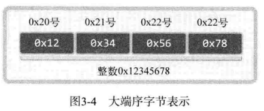

## 第 3 章 地址族与数据序列

### 分配给套接字的 IP 地址与端口号

IP 是 Internet Protocol（网络协议）的简写，是为收发网络数据而分配给计算机的值。端口号并非赋予计算机的值，而是为了区分程序中创建的套接字而分配给套接字的序号。

#### 网络地址（Internet Address）

为使计算机连接到网络并收发数据，必须为其分配 IP 地址。IP 地址分为两类。

- IPV4（Internet Protocol version 4）4 字节地址族
- IPV6（Internet Protocol version 6）16 字节地址族

两者之间的主要差别是 IP 地址所用的字节数，目前通用的是 IPV4 , IPV6 的普及还需要时间。

IPV4 标准的 4 字节 IP 地址分为网络地址和主机（指计算机）地址，且分为 A、B、C、D、E 等类型。


数据传输过程：


某主机向 203.211.172.103 和 203.211.217.202 传递数据，其中 203.211.172 和 203.211.217 为该网络的网络地址，所以「向相应网络传输数据」实际上是向构成网络的路由器或者交换机传输数据，然后由路由器或者交换机根据数据中的主机地址向目标主机传递数据。

#### 网络地址分类与主机地址边界

只需通过IP地址的第一个字节即可判断网络地址占用的总字节数，因为我们根据IP地址的边界区分网络地址，如下所示：

- A 类地址的首字节范围为：0~127
- B 类地址的首字节范围为：128~191
- C 类地址的首字节范围为：192~223

还有如下这种表示方式：

- A 类地址的首位以 0 开始
- B 类地址的前2位以 10 开始
- C 类地址的前3位以 110 开始

因此套接字收发数据时，数据传到网络后即可轻松找到主机。

#### 用于区分套接字的端口号

IP地址用于区分计算机，只要有IP地址就能向目标主机传输数据，但是只有这些还不够，我们需要把信息传输给具体的应用程序。

所以计算机一般有 NIC（网络接口卡）数据传输设备。通过 NIC 接收的数据内有端口号，操作系统参考端口号把信息传给相应的应用程序。

端口号由 16 位构成，可分配的端口号范围是 0~65535 。但是 0~1023 是知名端口，一般分配给特定的应用程序，所以应当分配给此范围之外的值。

虽然端口号不能重复，但是 TCP 套接字和 UDP 套接字不会共用端接口号，所以允许重复。如果某 TCP 套接字使用了 9190 端口号，其他 TCP 套接字就无法使用该端口号，但是 UDP 套接字可以使用。

总之，数据传输目标地址同时包含IP地址和端口号，只有这样，数据才会被传输到最终的目的应用程序。

### 网络字节序与地址变换

不同的 CPU 中，4 字节整数值1在内存空间保存方式是不同的。

有些 CPU 这样保存：

```
00000000 00000000 00000000 00000001
```

有些 CPU 这样保存：

```
00000001 00000000 00000000 00000000
```

两种一种是顺序保存，一种是倒序保存 。

#### 字节序（Order）与网络字节序

CPU 保存数据的方式有两种，这意味着 CPU 解析数据的方式也有 2 种：

- 大端序（Big Endian）：高位字节存放到低位地址
- 小端序（Little Endian）：高位字节存放到高位地址




两台字节序不同的计算机在数据传递的过程中可能出现的问题：


因为这种原因，所以在通过网络传输数据时必须约定统一的方式，这种约定被称为网络字节序（Network Byte Order），非常简单，统一为大端序。即，先把数据数组转化成大端序格式再进行网络传输。

#### 字节序转换

首先判断本机字节序：

```go
func IsLittleEndian()  bool{
    var value int32 = 1 // 占 4byte 转换成16进制 0x00 00 00 01 
    // 大端（16进制）：00 00 00 01
    // 小端（16进制）：01 00 00 00
    pointer := unsafe.Pointer(&value)
    pb := (*byte)(pointer)
    if *pb != 1 {
        return false
    }
    return true
}
```

大小端的转换可以通过位运算实现，以 `uint32` 类型作为例子：

```go
func SwapEndianUint32(val uint32) uint32 {
    return (val & 0xff000000) >> 24 | (val & 0x00ff0000) >> 8 |
        (val & 0x0000ff00) << 8 | (val & 0x000000ff) <<24
}
```

不过 Go 官方库 `encoding/binary` 中也提供了关于大小端的一些操作，就没必要造轮子了。

下面是转换字节序的示例：

[endian_conv.go](./endian_conv.go)

编译运行：

```shell
go run endian_conv.go
```

结果：

```
Host ordered port: 0x1234
Network ordered port: 0x3412
Host ordered port: 0x12345678
Network ordered port: 0x78563412
```

这是小端 CPU 的运行结果，大部分人会得到相同的结果，因为 Intel 和 AMD 的 CPU 都是采用小端序为标准。

### 网络地址的初始化与分配

#### 将字符串信息转换为网络字节序的整数型

将类似于 201.211.214.36 转换为 4 字节的整数类型数据：

```go
// IPstring to integer 把IP字符串转为数值
func aton32(ip string) (uint32, error) {
	b := net.ParseIP(ip).To4()
	if b == nil {
		return 0, errors.New("invalid ipv4 format")
	}

	i := uint32(b[3]) | uint32(b[2])<<8 | uint32(b[1])<<16 | uint32(b[0])<<24

	i = hton32(i) // 网络字节序使用大端序

	return i, nil
}
```

具体实现：

[inet_aton.go](./inet_aton.go)

编译运行：

```shell
go run inet_aton.go
```

输出：

```
Network ordered integer addr: 0x4f7ce87f
```

把网络字节序整数型IP地址转换成我们熟悉的字符串形式：

```go
// integer to IPstring
func ntoa32(net_addr uint32) (string, error) {
	if net_addr > math.MaxUint32 {
		return "", errors.New("beyond the scope of ipv4")
	}

	i := ntoh32(net_addr) // 转换为本地字节序的 ip 地址

	// 1.2.3.4
	// 0000 00001  0000 0010  0000 0011  0000 01000

	ip := make(net.IP, net.IPv4len)
	ip[0] = byte(i >> 24)
	ip[1] = byte(i >> 16)
	ip[2] = byte(i >> 8)
	ip[3] = byte(i)

	return ip.String(), nil
}
```

具体实现：

[inet_ntoa.go](./inet_ntoa.go)

编译运行：

```shell
go run inet_ntoa.go
```

输出：

```
Dotted-Decimal notation1: 1.2.3.4
```