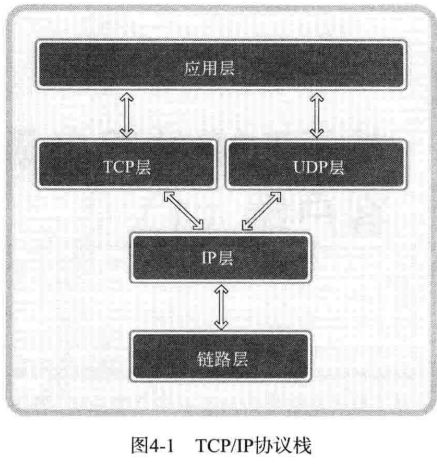
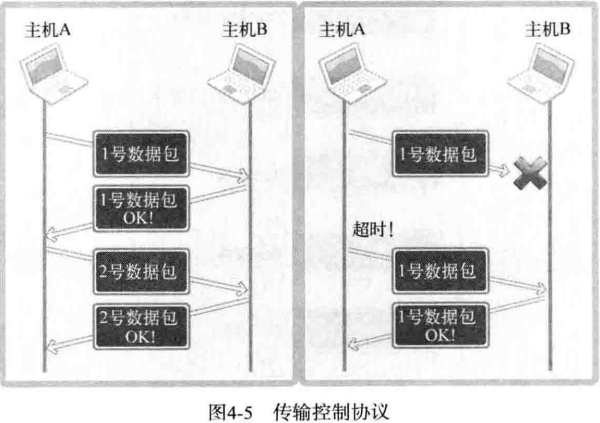
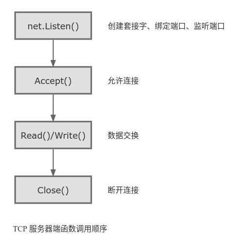
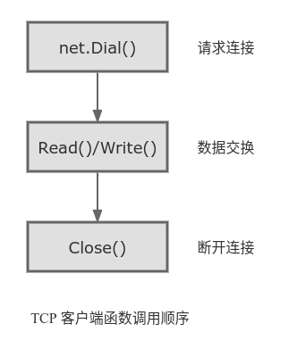
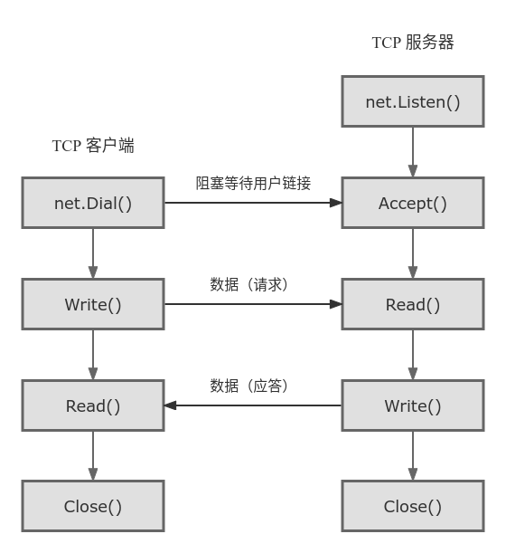
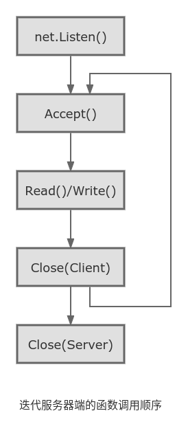
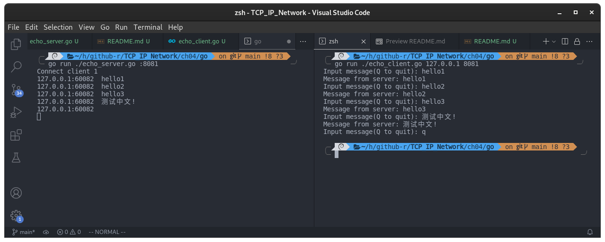

## 第 4 章 基于 TCP 的服务端/客户端（1）

### 理解 TCP 和 UDP

根据数据传输方式的不同，基于网络协议的套接字一般分为 TCP 套接字和 UDP 套接字。因为 TCP 套接字是面向连接的，因此又被称为基于流（stream）的套接字。

TCP 是 Transmission Control Protocol （传输控制协议）的简写，意为「对数据传输过程的控制」。因此，学习控制方法及范围有助于正确理解 TCP 套接字。

#### TCP/IP 协议栈



TCP/IP 协议栈共分为 4 层，可以理解为数据收发分成了 4 个层次化过程，通过层次化的方式来解决问题

#### 链路层

链路层是物理链接领域标准化的结果，也是最基本的领域，专门定义LAN、WAN、MAN等网络标准。若两台主机通过网络进行数据交换，则需要物理连接，链路层就负责这些标准。

#### IP 层

准备好物理连接后就要传输数据。为了在复杂网络中传输数据，首先要考虑路径的选择。向目标传输数据需要经过哪条路径？解决此问题的就是IP层，该层使用的协议就是IP。

IP 是面向消息的、不可靠的协议。每次传输数据时会帮我们选择路径，但并不一致。如果传输过程中发生错误，则选择其他路径，但是如果发生数据丢失或错误，则无法解决。换言之，IP协议无法应对数据错误。

#### TCP/UDP 层

IP 层解决数据传输中的路径选择问题，只需照此路径传输数据即可。TCP 和 UDP 层以 IP 层提供的路径信息为基础完成实际的数据传输，故该层又称为传输层。UDP 比 TCP 简单，现在我们只解释 TCP。TCP 可以保证数据的可靠传输，但是它发送数据时以 IP 层为基础（这也是协议栈层次化的原因）。

IP 层只关注一个数据包（数据传输基本单位）的传输过程。因此，即使传输多个数据包，每个数据包也是由 IP 层实际传输的，也就是说传输顺序及传输本身是不可靠的。若只利用IP层传输数据，则可能导致后传输的数据包B比先传输的数据包A提早到达。另外，传输的数据包A、B、C中可能只收到A和C，甚至收到的C可能已经损毁。反之，若添加 TCP 协议则按照如下对话方式进行数据交换。

> 主机A：正确接受第二个数据包
>
> 主机B：恩，知道了
>
> 主机A：正确收到第三个数据包
>
> 主机B：可我已经发送第四个数据包了啊！哦，您没收到吧，我给你重新发。

这就是 TCP 的作用。如果交换数据的过程中可以确认对方已经收到数据，并重传丢失的数据，那么即便IP层不保证数据传输，这类通信也是可靠的。



#### 应用层

上述内容是套接字通信过程中自动处理的。选择数据传输路径、数据确认过程都被隐藏到套接字内部。向程序员提供的工具就是套接字，只需要利用套接字编出程序即可。编写软件的过程中，需要根据程序的特点来决定服务器和客户端之间的数据传输规则，这便是应用层协议。

### 实现基于 TCP 的服务器/客户端

#### TCP 服务端函数的调用顺序



#### net.Listen()

`net.Listen()` 方法在先创建一个系统 socket；然后设置了 socket 的一些属性，例如是否只支持 ipv6；然后绑定到我们指定的端口，最后一直监听这个端口。

```go
import "net"
func net.Listen(network string, address string) (net.Listener, error)
/*
network: 传入的网络协议，tcp，tcp4，tcp6 等。
address: 监听的地址，ip:port 格式，如果不指定 ip，默认使用 127.0.0.1。
net.Listener: 本质是一个套接字描述符。
*/
```

#### Accept()

当服务端调用 net.Listen() 后会开始监听指定地址，而客户端调用 net.Dial() 后发起连接请求，然后服务端调用 net.Accept() 接收请求，这里端与端的连接就建立好了，实际上到这一步也就完成了TCP中的三次握手。

```go
import "net"
func (net.Listener).Accept() (net.Conn, error)
// 返回 tcp 连接
```

#### 回顾 ch01 Hello World 服务端

- 代码：[hello_server.go](./hello_server.go)

1. 调用 net.Listen() 方法，创建套接字（不过此时的套接字并非是真正的服务端套接字）、设置请求状态队列长度（Go 语言帮我们设置了，我们不需要关心）、绑定监听端口，这个方法返回一个 listener，这个 listener 其实也是一个套接字，它才是服务端套接字。
2. 调用 Accept() 方法与客户端建立连接。
3. 调用 Write() 方法向客户端传送数据。

#### TCP 客户端函数的调用顺序



创建客户端只需要使用 net.Dial() 方法就可以了。

```go
import "net"
func net.Dial(network string, address string) (net.Conn, error)
/*
network: 传入的网络协议，tcp，tcp4，tcp6 等。
address: 监听的地址，ip:port 格式，如果不指定 port，将由系统自动分配一个端口。
*/
```

#### 回顾 ch01 Hello World 客户端

- 代码：[hello_client.go](./hello_client.go)

1. 调用 net.Dial() 方法向服务端发起连接请求。
2. 完成连接后，接收服务端传输的数据。
3. 接收数据后调用 Close() 方法关闭套接字，结束与服务器端的连接。如果客户端的套接字调用了 Close() 方法，服务端调用 Read() 返回的错误为 `io.EOF`。

#### 基于 TCP 的服务端/客户端函数调用关系

关系图如下所示：



- 客户端只能等到服务端调用 net.Listen() 函数后才才能调用 net.Dial() 函数。
- 服务器端可能会在客户端调用 net.Dial() 之前调用 Accept() 函数，这时服务器端进入阻塞（blocking）状态，直到客户端调用 net.Dial() 函数后接收到连接请求。

### 实现迭代服务端/客户端

编写一个回声（echo）服务器/客户端。顾名思义，服务端将客户端传输的字符串数据原封不动的传回客户端，就像回声一样。在此之前，需要解释一下迭代服务器端。

#### 4.3.1 实现迭代服务器端

在 Hello World 的例子中，如果想继续处理好后面的客户端请求应该怎样扩展代码？最简单的方式就是插入循环反复调用 Accept() 函数，如图:



可以看出，调用 Accept() 函数后，紧接着调用 I/O 相关的 Read(), Write() 函数，然后调用 Close() 函数。这并非针对服务器套接字，而是针对 Accept() 函数调用时创建的套接字。

#### 4.3.2 迭代回声服务器端/客户端

程序运行的基本方式：

- 服务器端在同一时刻只与一个客户端相连，并提供回声服务。
- 服务器端依次向 5 个客户端提供服务并退出。
- 客户端接受用户输入的字符串并发送到服务器端。
- 服务器端将接受的字符串数据传回客户端，即「回声」。
- 服务器端与客户端之间的字符串回声一直执行到客户端输入 Q 为止。

以下是服务端与客户端的代码：

- [echo_server.go](./echo_server.go)
- [echo_client.go](./echo_client.go)

编译运行：

```shell
go run ./echo_server.go :8081
go run ./echo_client.go 127.0.0.1 8081
```

过程和结果：

在一个服务端开启后，用另一个终端窗口开启客户端，然后程序会让你输入字符串，然后客户端输入什么字符串，客户端就会返回什么字符串，按 q 退出。这时服务端的运行并没有结束，服务端一共要处理 5 个客户端的连接，所以另外开多个终端窗口同时开启客户端，服务器按照顺序进行处理。



#### 回声客户端存在的问题

以上客户端代码有一个假设「每次调用 read、write函数时都会以字符串为单位执行实际 I/O 操作」

但是「第二章」中说过「TCP 不存在数据边界」，上述客户端是基于 TCP 的，因此多次调用 write 函数传递的字符串有可能一次性传递到服务端。此时客户端有可能从服务端收到多个字符串，这不是我们想要的结果。还需要考虑服务器的如下情况：

「字符串太长，需要分 2 个包发送！」

服务端希望通过调用 1 次 write 函数传输数据，但是如果数据太大，操作系统就有可能把数据分成多个数据包发送到客户端。另外，在此过程中，客户端可能在尚未收到全部数据包时就调用 read 函数。

以上的问题都是源自 TCP 的传输特性，解决方法在第 5 章。