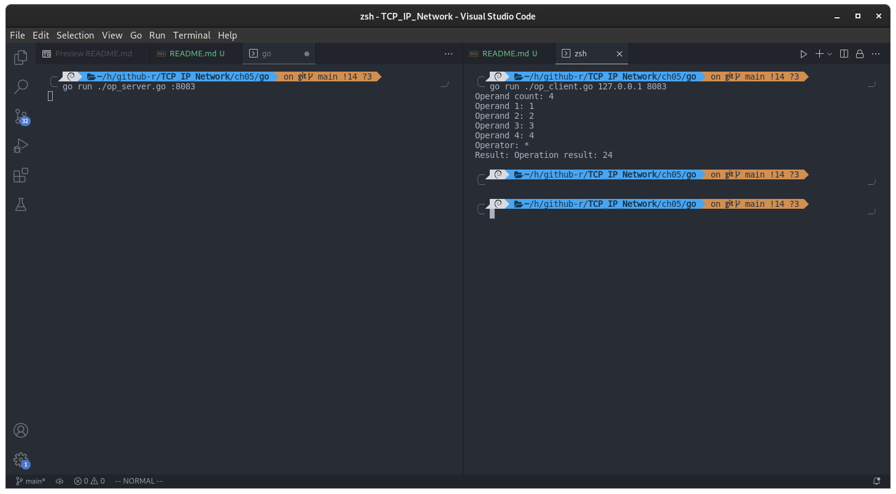
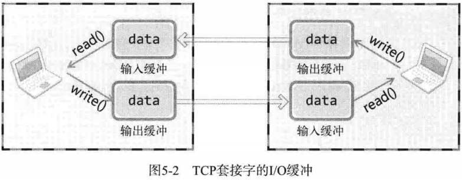
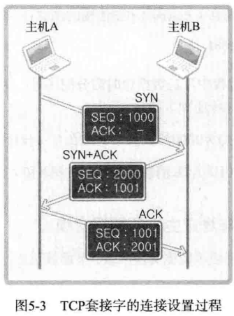
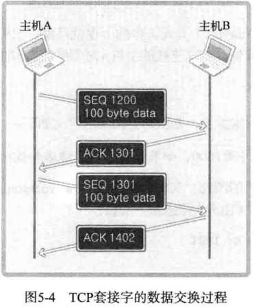
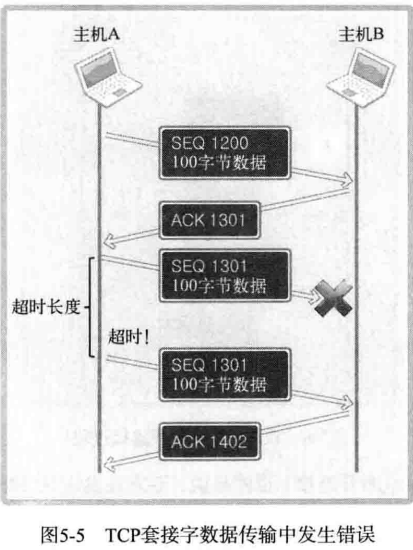
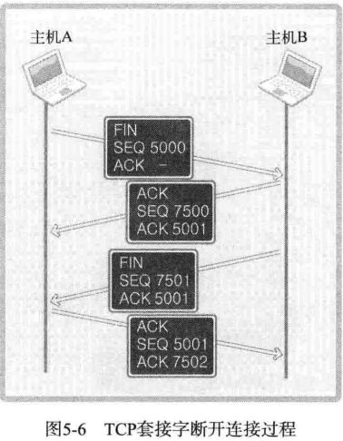

## 第 5 章 基于 TCP 的服务端/客户端（2）

上一章仅仅是从编程角度学习实现方法，并未详细讨论 TCP 的工作原理。因此，本章将想次讲解 TCP 中必要的理论知识，还将给出第 4 章客户端问题的解决方案。

### 回声客户端的完美实现

#### 回声服务器没有问题，只有回声客户端有问题？

问题不在服务器端，而在客户端，只看代码可能不好理解，因为 I/O 中使用了相同的函数。先回顾一下服务器端的 I/O 相关代码（省略了输入提示等不相关内容）：

```go
for {
    str_len, err := conn.Read(message)
    if err == io.EOF {
        break
    }
    conn.Write(message[:str_len])
}
```

接着是客户端代码:

```go
str_len, _ = conn.Write(message)
str_len, _ = conn.Read(message)
```

二者都在循环调用 read 和 write 函数。实际上之前的回声客户端将 100% 接受字节传输的数据，只不过接收数据时的单位有些问题。扩展客户端代码回顾范围，下面是，客户端的代码:

```c
for {
    fmt.Print("Input message(Q to quit): ")
    fmt.Scanf("%s", &message)

    if string(message) == "q" || string(message) == "Q" {
        break
    }

    str_len, err = conn.Write(message)
    if err != nil {
        checkError(err)
    }

    message[0] = 0 // 确保 message 里面的数据是从服务方发来的

    str_len, err = conn.Read(message)
    if err != nil {
        checkError(err)
    }
    fmt.Printf("Message from server: %s\n", message[:str_len])
}
```

现在应该理解了问题，回声客户端传输的是字符串，而且是通过调用 Write() 函数一次性发送的。之后还调用一次 Read() 函数，期待着接受自己传输的字符串，这就是问题所在。

#### 回声客户端问题的解决办法

这个问题其实很容易解决，因为可以提前接受数据的大小。若之前传输了 20 字节长的字符串，则再接收时循环调用 Read() 函数读取 20 个字节即可。既然有了解决办法，那么代码如下：

- [echo_client2.c](./echo_client2.go)

这样修改为了接收所有传输数据而循环调用 Read() 函数。测试及运行结果可参考第四章。

#### 如果问题不在于回声客户端：定义应用层协议

回声客户端可以提前知道接收数据的长度，这在大多数情况下是不可能的。那么此时无法预知接收数据长度时应该如何收发数据？这时需要的是**应用层协议**的定义。在收发过程中定好规则（协议）以表示数据边界，或者提前告知需要发送的数据的大小。服务端/客户端实现过程中逐步定义的规则集合就是应用层协议。

现在写一个小程序来体验应用层协议的定义过程。要求：

1. 服务器从客户端获得多个数组和运算符信息。
2. 服务器接收到数字候对齐进行加减乘运算，然后把结果传回客户端。

例：

1. 向服务器传递 3,5,9 后请求加法运算，服务器返回 3+5+9 的结果。
2. 请求做乘法运算，客户端会收到`3*5*9`的结果。
3. 如果向服务器传递 4,3,2 后要求做减法，则返回 4-3-2 的运算结果。

- [op_client.go](./op_client.go)
- [op_server.go](./op_server.go)

编译运行：

```shell
go run op_server.go :8081
go run op_client.go 127.0.0.1 8081
```



### TCP 原理

#### TCP 套接字中的 I/O 缓冲

TCP 套接字的数据收发无边界。服务器即使调用 1 次 write 函数传输 40 字节的数据，客户端也有可能通过 4 次 read 函数调用每次读取 10 字节。但此处也有一些疑问，服务器一次性传输了 40 字节，而客户端竟然可以缓慢的分批接受。客户端接受 10 字节后，剩下的 30 字节在何处等候呢？

实际上，write 函数调用后并非立即传输数据， read 函数调用后也并非马上接收数据。如图所示，write 函数调用瞬间，数据将移至输出缓冲；read 函数调用瞬间，从输入缓冲读取数据。



I/O 缓冲特性可以整理如下：

- I/O 缓冲在每个 TCP 套接字中单独存在
- I/O 缓冲在创建套接字时自动生成
- 即使关闭套接字也会继续传递输出缓冲中遗留的数据
- 关闭套接字将丢失输入缓冲中的数据

假设发生以下情况，会发生什么事呢？

> 客户端输入缓冲为 50 字节，而服务器端传输了 100 字节。

因为 TCP 不会发生超过输入缓冲大小的数据传输。也就是说，根本不会发生这类问题，因为 TCP 会控制数据流。TCP 中有滑动窗口（Sliding Window）协议，用对话方式如下：

> - A：你好，最多可以向我传递 50 字节
> - B：好的
> - A：我腾出了 20 字节的空间，最多可以接受 70 字节
> - B：好的

数据收发也是如此，因此 TCP 中不会因为缓冲溢出而丢失数据。

**write 函数在数据传输完成时返回。**

#### TCP 内部工作原理 1：与对方套接字的连接

TCP 套接字从创建到消失所经过的过程分为如下三步：

- 与对方套接字建立连接
- 与对方套接字进行数据交换
- 断开与对方套接字的连接

首先讲解与对方套接字建立连接的过程。连接过程中，套接字的对话如下：

- 套接字A：你好，套接字 B。我这里有数据给你，建立连接吧
- 套接字B：好的，我这边已就绪
- 套接字A：谢谢你受理我的请求

TCP 在实际通信中也会经过三次对话过程，因此，该过程又被称为 **Three-way handshaking（三次握手）**。接下来给出连接过程中实际交换的信息方式：



套接字是全双工方式工作的。也就是说，它可以双向传递数据。因此，收发数据前要做一些准备。首先请求连接的主机 A 要给主机 B 传递以下信息：

> [SYN] SEQ : 1000 , ACK:-

该消息中的 SEQ 为 1000 ，ACK 为空，而 SEQ 为1000 的含义如下：

> 现在传递的数据包的序号为 1000，如果接收无误，请通知我向您传递 1001 号数据包。

这是首次请求连接时使用的消息，又称为 SYN。SYN 是 Synchronization 的简写，表示收发数据前传输的同步消息。接下来主机 B 向 A 传递以下信息：

> [SYN+ACK] SEQ: 2000, ACK: 1001

此时 SEQ 为 2000，ACK 为 1001，而 SEQ 为 2000 的含义如下：

> 现传递的数据包号为 2000 ，如果接受无误，请通知我向您传递 2001 号数据包。

而 ACK 1001 的含义如下：

> 刚才传输的 SEQ 为 1000 的数据包接受无误，现在请传递 SEQ 为 1001 的数据包。

对于主机 A 首次传输的数据包的确认消息（ACK 1001）和为主机 B 传输数据做准备的同步消息（SEQ 2000）捆绑发送。因此，此种类消息又称为 SYN+ACK。

收发数据前向数据包分配序号，并向对方通报此序号，这都是为了防止数据丢失做的准备。通过向数据包分配序号并确认，可以在数据包丢失时马上查看并重传丢失的数据包。因此 TCP 可以保证可靠的数据传输。

通过这三个过程，这样主机 A 和主机 B 就确认了彼此已经准备就绪。

#### TCP 内部工作原理 2：与对方主机的数据交换

通过第一步三次握手过程完成了数据交换准备，下面就开始正式收发数据，其默认方式如图所示：



图上给出了主机 A 分成 2 个数据包向主机 B 传输 200 字节的过程。首先，主机 A 通过 1 个数据包发送 100 个字节的数据，数据包的 SEQ 为 1200 。主机 B 为了确认这一点，向主机 A 发送 ACK 1301 消息。

此时的 ACK 号为 1301 而不是 1201，原因在于 ACK 号的增量为传输的数据字节数。假设每次 ACK 号不加传输的字节数，这样虽然可以确认数据包的传输，但无法明确 100 个字节全都正确传递还是丢失了一部分，比如只传递了 80 字节。因此按照如下公式传递 ACK 信息：

> ACK 号 = SEQ 号 + 传递的字节数 + 1

与三次握手协议相同，最后 + 1 是为了告知对方下次要传递的 SEQ 号。下面分析传输过程中数据包丢失的情况：



上图表示了通过 SEQ 1301 数据包向主机 B 传递 100 字节数据。但中间发生了错误，主机 B 未收到，经过一段时间后，主机 A 仍然未收到对于 SEQ 1301 的 ACK 的确认，因此试着重传该数据包。为了完成该数据包的重传，TCP 套接字启动计时器以等待 ACK 应答。若相应计时器发生超时（Time-out!）则重传。

#### TCP 内部工作原理 3：断开套接字的连接

TCP 套接字的结束过程也非常优雅。如果对方还有数据需要传输时直接断掉该连接会出问题，所以断开连接时需要双方协商，断开连接时双方的对话如下：

> - 套接字A：我希望断开连接
> - 套接字B：哦，是吗？请稍后。
> - 套接字A：我也准备就绪，可以断开连接。
> - 套接字B：好的，谢谢合作。

先由套接字 A 向套接字 B 传递断开连接的信息，套接字 B 发出确认收到的消息，然后向套接字 A 传递可以断开连接的消息，套接字 A 同样发出确认消息。



图中数据包内的 FIN 表示断开连接。也就是说，双方各发送 1 次 FIN 消息后断开连接。此过过程经历 4 个阶段，因此又称四次握手（Four-way handshaking）。SEQ 和 ACK 的含义与之前讲解的内容一致，省略。图中，主机 A 传递了两次 ACK 5001，也许这里会有困惑。其实，第二次 FIN 数据包中的 ACK 5001 只是因为接收了 ACK 消息后未接收到的数据重传的。