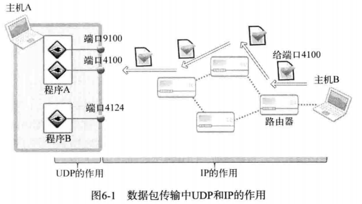
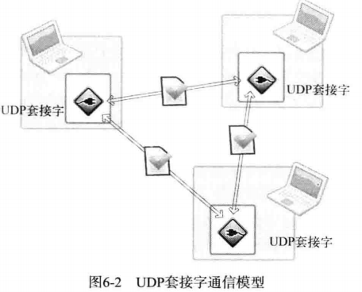
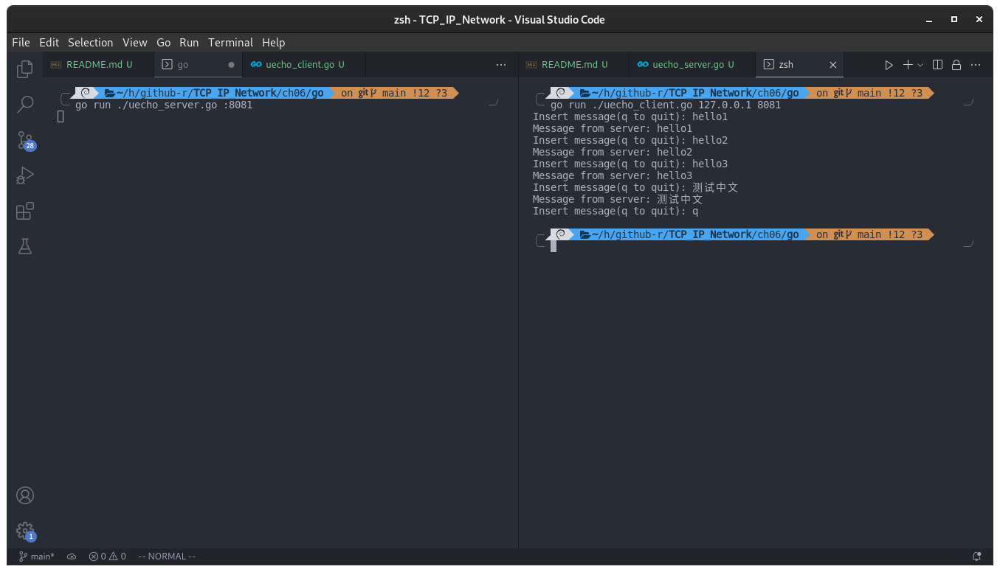
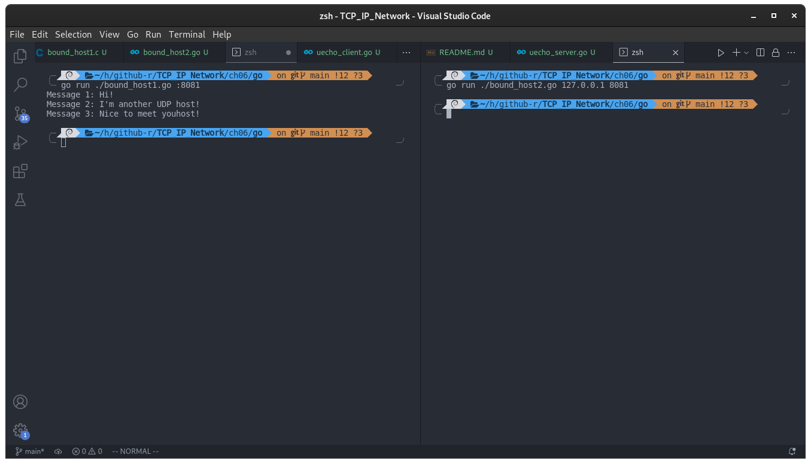

## 第 6 章 基于 UDP 的服务端/客户端

TCP 是内容较多的一个协议，而本章中的 UDP 内容较少，但是也很重要。

### 理解 UDP

#### UDP 套接字的特点

通过寄信来说明 UDP 的工作原理，这是讲解 UDP 时使用的传统示例，它与 UDP 的特点完全相同。寄信前应先在信封上填好寄信人和收信人的地址，之后贴上邮票放进邮筒即可。当然，信件的特点使我们无法确认信件是否被收到。邮寄过程中也可能发生信件丢失的情况。也就是说，信件是一种不可靠的传输方式，UDP 也是一种不可靠的数据传输方式。

因为 UDP 没有 TCP 那么复杂，所以编程难度比较小，性能也比 TCP 高。在更重视性能的情况下可以选择 UDP 的传输方式。

TCP 与 UDP 的区别很大一部分来源于流控制。也就是说 TCP 的生命在于流控制。

#### UDP 的工作原理

如图所示：



从图中可以看出，IP 的作用就是让离开主机 B 的 UDP 数据包准确传递到主机 A 。但是把 UDP 数据包最终交给主机 A 的某一 UDP 套接字的过程是由 UDP 完成的。UDP 的最重要的作用就是根据端口号将传到主机的数据包交付给最终的 UDP 套接字。

#### UDP 的高效使用

UDP 也具有一定的可靠性。对于通过网络实时传递的视频或者音频时情况有所不同。对于多媒体数据而言，丢失一部分数据也没有太大问题，这只是会暂时引起画面抖动，或者出现细微的杂音。但是要提供实时服务，速度就成为了一个很重要的因素。因此流控制就显得有一点多余，这时就要考虑使用 UDP 。TCP 比 UDP 慢的原因主要有以下两点：

- 收发数据前后进行的连接设置及清除过程。
- 收发过程中为保证可靠性而添加的流控制。

如果收发的数据量小但是需要频繁连接时，UDP 比 TCP 更高效。

### 实现基于 UDP 的服务端/客户端

#### UDP 中的服务端和客户端没有连接

UDP 中的服务端和客户端不像 TCP 那样在连接状态下交换数据，因此与 TCP 不同，无需经过连接过程。Go 语言对 TCP、UDP 进行了封装，使得在客户端只需要调用 net.Dial() 方法就可以了；而在服务端，由于 UDP 无需经过连接过程，所以不必调用 TCP 连接过程中调用的 Accept() 函数了，只需要创建 socket 后监听指定的端口就可以。

#### UDP 服务器和客户端均只需一个套接字

TCP 中，套接字之间应该是一对一的关系。若要向 10 个客户端提供服务，除了守门的服务器套接字之外，还需要 10 个服务器套接字。但在 UDP 中，不管是服务器端还是客户端都只需要 1 个套接字。只需要一个 UDP 套接字就可以向任意主机传输数据，如图所示：



图中展示了 1 个 UDP 套接字与 2 个不同主机交换数据的过程。也就是说，只需 1 个 UDP 套接字就能和多台主机进行通信。

#### 基于 UDP 的数据 I/O 函数

创建好 TCP 套接字以后，传输数据时无需加上地址信息。因为 TCP 套接字将保持与对方套接字的连接。换言之，TCP 套接字知道目标地址信息。但 UDP 套接字不会保持连接状态（UDP 套接字只有简单的邮筒功能），因此每次传输数据时都需要添加目标的地址信息。这相当于寄信前在信件中填写地址。接下来是 UDP 的相关函数：

```go
import "net"
func (net.PacketConn).WriteTo(p []byte, addr net.Addr) (n int, err error)
/*
p: 发送到客户端的信息
addr: 客户端的地址
n: 发送出去的字节数
*/
```

上述函数与之前的 TCP 输出函数最大的区别在于，此函数需要向它传递目标地址信息。接下来介绍接收 UDP 数据的函数。UDP 数据的发送并不固定，因此该函数定义为可接受发送端信息的形式，也就是将同时返回 UDP 数据包中的发送端信息。

```go
import "net"
func (net.PacketConn).ReadFrom(p []byte) (n int, addr net.Addr, err error)
/*
p: 接收来自客户端的信息
n: 接收到的信息的字节数
addr: 客户端的地址
*/
```

编写 UDP 程序的最核心的部分就在于上述两个函数，这也说明二者在 UDP 数据传输中的地位。

#### 基于 UDP 的回声服务器端/客户端

- [uecho_client.go](./uecho_client.go)
- [uecho_server.go](./uecho_server.go)

编译运行：

```shell
go run ./uecho_server.go :8081
go run ./uecho_client.go 127.0.0.1 8081
```

结果：




#### 6.2.5 UDP 客户端套接字的地址分配

UDP 客户端的 IP 和端口的分配在调用 net.Dial() 函数的过程中完成。此时分配的地址一直保留到程序结束为止，因此也可以用来和其他 UDP 套接字进行数据交换。当然，IP 用主机IP，端口号用未选用的任意端口号。

### UDP 的数据传输特性和建立 unconnected 的 UDP 套接字

#### 存在数据边界的 UDP 套接字

前面说得 TCP 数据传输中不存在数据边界，这表示「数据传输过程中调用 I/O 函数的次数不具有任何意义」

相反，UDP 是具有数据边界的下一，传输中调用 I/O 函数的次数非常重要。因此，输入函数的调用次数和输出函数的调用次数应该完全一致，这样才能保证接收全部已经发送的数据。例如，调用 3 次输出函数发送的数据必须通过调用 3 次输入函数才能接收完。通过一个例子来进行验证：

- [bound_host1.go](./bound_host1.go)
- [bound_host2.go](./bound_host2.go)

编译运行：

```go
go run ./bound_host1.go :8081
go run ./bound_host2.go 127.0.0.1 8081
```

运行结果：



host1 是服务端，host2 是客户端，host2 一次性把数据发给服务端后，结束程序。但是因为服务端每隔五秒才接收一次，所以服务端每隔五秒接收一次消息。

**从运行结果也可以证明 UDP 通信过程中 I/O 的调用次数必须保持一致**

#### 已连接（connected）UDP 套接字与未连接（unconnected）UDP 套接字

<!-- 我们的 [uecho_client.go](./uecho_client.go) 中的代码与《TCP/IP网络编程》中的 C 语言代码建立的 UDP 连接有不同之处，[uecho_client.go](./uecho_client.go) 中使用 net.Dial() 方法建立的 UDP 套接字是 connected 套接字，而《TCP/IP网络编程》中客户端建立的套接字是 unconnected 套接字。 -->

什么是 connected UDP 套接字，什么是 unconnected UDP 套接字？

先指出：[uecho_client.go](./uecho_client.go) 中建立的 UDP 套接字是 connected UDP 套接字；[uecho_server.go](./uecho_server.go) 中建立的 UDP 套接字是 unconnected UDP 套接字。

- 客户端使用 net.Dial 创建 UDP 套接字，并同时为这个套接字设置本地地址和目标地址，这时 Go 将它称之为 connected，尽管我们知道 UDP 是无连接的协议，Go 这种叫法根源来自 Unix/Linux 的 UDP 的实现。

    Linux 关于 UDP 的文档：

    > When a UDP socket is created, its local and remote addresses are unspecified. Datagrams can be sent immediately using sendto or sendmsg with a valid destination address as an argument. When connect is called on the socket, the default destination address is set and datagrams can now be sent using send or write without specifying a destination address. It is still possible to send to other destinations by passing an address to sendto or sendmsg. In order to receive packets, the socket can be bound to a local address first by using bind. Otherwise, the socket layer will automatically assign a free local port out of the range defined by /proc/sys/net/ipv4/ip_local_port_range and bind the socket to INADDR_ANY.

- 而服务端使用 net.ListenPacket 创建的 UDP 套接字只制定了本地绑定的地址，没有设置目标地址，它只能被动地接收来自客户端的消息，这样的连接在 Go 中被称为 unconnected 类型。

### 创建未连接的 UDP 套接字

可以在客户端创建未连接的 UDP 套接字吗？

我们尝试在客户端使用 net.ListenPacket()，不过这时 “客户端” 还是客户端吗？

- [uecho_con_client.go](./uecho_con_client.go)

编译运行过程与上面一样，故省略。