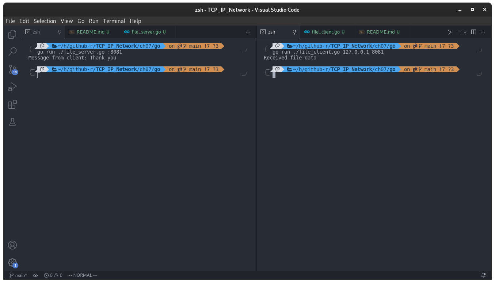

## 第 7 章 优雅地断开套接字的连接

[C 语言优雅地断开套接字的连接](../c/README.md)

Go 语言中并未找到关于 TCP 半关闭的方法，这里使用 CGO 调用 C 语言库，也实现了半关闭的操作：

#### 基于半关闭的文件传输程序

下面的代码为编程简便，省略了大量错误处理代码。

- [file_client.go](./file_client.go)
- [file_server.go](./file_server.go)

编译运行：

```shell
go run ./file_server.go :8081
go run ./file_client.go 127.0.0.1 8081
```

结果：



客户端接受完成后，服务器会接收到来自客户端的感谢信息。