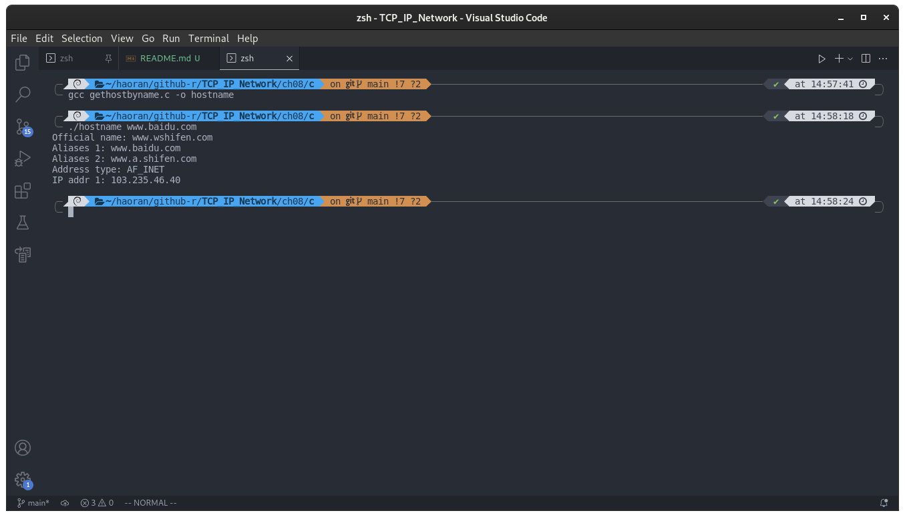
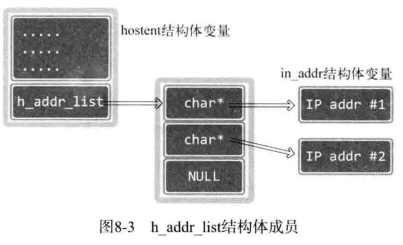
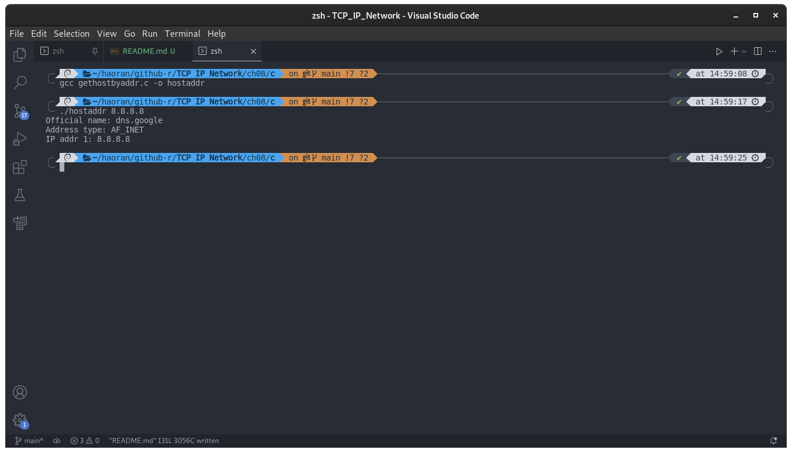

## 第 8 章 域名及网络地址

### 8.1 域名系统

DNS 是对IP地址和域名进行相互转换的系统，其核心是 DNS 服务器

#### 8.1.1 什么是域名

域名就是我们常常在地址栏里面输入的地址，将比较难记忆的IP地址变成人类容易理解的信息。

#### 8.1.2 DNS 服务器

相当于一个字典，可以查询出某一个域名对应的IP地址


如图所示，显示了 DNS 服务器的查询路径。

### 8.2 IP地址和域名之间的转换

#### 8.2.1 程序中有必要使用域名吗？

一句话，需要，因为IP地址可能经常改变，而且也不容易记忆，通过域名可以随时更改解析，达到更换IP的目的

#### 8.2.2 利用域名获取IP地址

使用以下函数可以通过传递字符串格式的域名获取IP地址

```c
#include <netdb.h>
struct hostent *gethostbyname(const char *hostname);
/*
成功时返回 hostent 结构体地址，失败时返回 NULL 指针
*/
```

这个函数使用方便，只要传递字符串，就可以返回域名对应的IP地址。只是返回时，地址信息装入 hostent 结构体。此结构体的定义如下：

```c
struct hostent
{
    char *h_name;       /* Official name of host.  */
    char **h_aliases;   /* Alias list.  */
    int h_addrtype;     /* Host address type.  */
    int h_length;       /* Length of address.  */
    char **h_addr_list; /* List of addresses from name server.  */
};
```

从上述结构体可以看出，不止返回IP信息，同事还带着其他信息一起返回。域名转换成IP时只需要关注 h_addr_list 。下面简要说明上述结构体的成员：

- h_name：该变量中存有官方域名（Official domain name）。官方域名代表某一主页，但实际上，一些著名公司的域名并没有用官方域名注册。
- h_aliases：可以通过多个域名访问同一主页。同一IP可以绑定多个域名，因此，除官方域名外还可以指定其他域名。这些信息可以通过 h_aliases 获得。
- h_addrtype：gethostbyname 函数不仅支持 IPV4 还支持 IPV6 。因此可以通过此变量获取保存在 h_addr_list 的IP地址族信息。若是 IPV4 ，则此变量中存有 AF_INET。
- h_length：保存IP地址长度。若是 IPV4 地址，因为是 4 个字节，则保存4；IPV6 时，因为是 16 个字节，故保存 16
- h_addr_list：这个是最重要的的成员。通过此变量以整数形式保存域名相对应的IP地址。另外，用户比较多的网站有可能分配多个IP地址给同一个域名，利用多个服务器做负载均衡，。此时可以通过此变量获取IP地址信息。

调用 gethostbyname 函数后，返回的结构体变量如图所示：


下面的代码通过一个例子来演示 gethostbyname 的应用，并说明 hostent 结构体变量特性。

- [gethostbyname.c](./gethostbyname.c)

编译运行：

```shell
gcc gethostbyname.c -o hostname
./hostname www.baidu.com
```

结果：



如图所示，显示出了对百度的域名解析

可以看出，百度有一个域名解析是 CNAME 解析的，指向了`shifen.com`，关于百度具体的解析过程。

> 这一部分牵扯到了很多关于DNS解析的过程，还有 Linux 下关于域名解析的一些命令，我找了一部分资料，可以点下面的链接查看比较详细的：
>
> - [关于百度DNS的解析过程](http://zhan.renren.com/starshen?gid=3602888498023142484&checked=true)
> - [DNS解析的过程是什么，求详细的？](https://www.zhihu.com/question/23042131/answer/66571369)
> - [Linux DNS 查询剖析](https://zhuanlan.zhihu.com/p/45535596)
> - [Linux DNS查询命令](http://www.live-in.org/archives/1938.html)
> - [Linux中DNS服务器地址查询命令nslookup使用教程](https://blog.csdn.net/shangdi1988/article/details/65713077)
> - [DNS 原理入门](http://www.ruanyifeng.com/blog/2016/06/dns.html)
>

仔细阅读这一段代码：

```c
inet_ntoa(*(struct in_addr *)host->h_addr_list[i])
```

若只看 hostent 的定义，结构体成员 h_addr_list 指向字符串指针数组（由多个字符串地址构成的数组）。但是字符串指针数组保存的元素实际指向的是 in_addr 结构体变量中地址值而非字符串，也就是说`(struct in_addr *)host->h_addr_list[i]`其实是一个指针，然后用`*`符号取具体的值。如图所示：



#### 8.2.3 利用IP地址获取域名

请看下面的函数定义：

```c
#include <netdb.h>
struct hostent *gethostbyaddr(const char *addr, socklen_t len, int family);
/*
成功时返回 hostent 结构体变量地址值，失败时返回 NULL 指针
addr: 含有IP地址信息的 in_addr 结构体指针。为了同时传递 IPV4 地址之外的全部信息，该变量的类型声明为 char 指针
len: 向第一个参数传递的地址信息的字节数，IPV4时为 4 ，IPV6 时为16.
family: 传递地址族信息，ipv4 是 AF_INET ，IPV6是 AF_INET6
*/
```

下面的代码演示使用方法：

- [gethostbyaddr.c](./gethostbyaddr.c)

编译运行：

```shell
gcc gethostbyaddr.c -o hostaddr
./hostaddr 8.8.8.8
```

结果：



从图上可以看出，`8.8.8.8`这个IP地址是谷歌的。