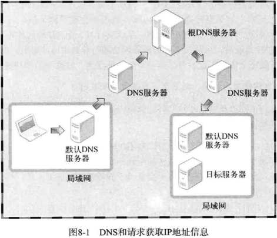

## 第 8 章 域名及网络地址

### 域名系统

DNS 是对IP地址和域名进行相互转换的系统，其核心是 DNS 服务器

#### 什么是域名

域名就是我们常常在地址栏里面输入的地址，将比较难记忆的IP地址变成人类容易理解的信息。

#### DNS 服务器

相当于一个字典，可以查询出某一个域名对应的IP地址



如图所示，显示了 DNS 服务器的查询路径。

### IP地址和域名之间的转换

#### 程序中有必要使用域名吗？

一句话，需要，因为IP地址可能经常改变，而且也不容易记忆，通过域名可以随时更改解析，达到更换IP的目的

#### 利用域名获取 IP 地址

使用以下函数可以通过传递字符串格式的域名获取 IP 地址：

```go
import "net"
func net.LookupHost(host string) (addrs []string, err error)
```

这个函数使用方便，只要传递字符串，就可以返回域名对应的 IP 地址。

下面的代码通过一个例子来演示 gethostbyname 的应用。

- [gethostbyname.go](./gethostbyname.go)

编译运行：

```shell
go run ./gethostbyname.go www.baidu.com
```

结果：


#### 利用 IP 地址获取域名

```go
import "net"
func net.LookupAddr(addr string) (names []string, err error)
```

下面的代码演示使用方法：

- [gethostbyaddr.go](./gethostbyaddr.go)

编译运行：

```shell
go run gethostbyaddr.go 8.8.8.8
```

结果：


从图上可以看出，`8.8.8.8`这个IP地址是谷歌的。