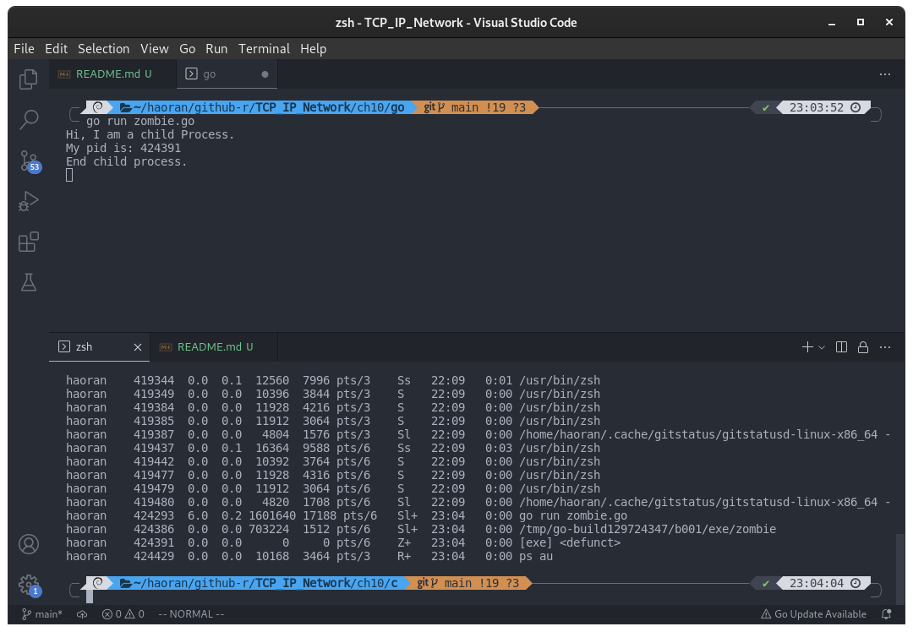

## 第 10 章 多进程服务器端

### 进程概念及应用

#### 并发服务端的实现方法

通过改进服务端，使其同时向所有发起请求的客户端提供服务，以提高平均满意度。而且，网络程序中数据通信时间比 CPU 运算时间占比更大，因此，向多个客户端提供服务是一种有效的利用 CPU 的方式。接下来讨论同时向多个客户端提供服务的并发服务器端。下面列出的是具有代表性的并发服务端的实现模型和方法：

- 多进程服务器：通过创建多个进程提供服务
- 多路复用服务器：通过捆绑并统一管理 I/O 对象提供服务
- 多线程服务器：通过生成与客户端等量的线程提供服务

先是第一种方法：多进程服务器

#### 理解进程

[c/README.md](../c/README.md)

#### 如何在 Go 语言中创建进程

Go 语言屏蔽了进程、线程的概念，只提供了 goroutine 的概念，

虽然 Go 提供了进程相关的操作，但没有直接提供 fork 系统调用的封装。

虽然可以通过 syscall.Syscall(syscall.SYS_FORK, 0, 0, 0) 调用系统的 fork 函数，但是因为 go 程序里面使用了线程，不能够简单的通过 fork 来实现子进程，否则会出现各种错乱。

那么我们能不能通过一些封装，实现类似 fork 的操作呢？解决方案只有以下三种：

- syscall.ForkExec
- os.StartProcess
- exec.Cmd

这三个都类似于 fork + exec，但是没有类似 C 中的 fork 调用可以达到在 fork 之后根据返回的 pid 然后进入不同的函数的方案。

<!-- 原因主要是：
- fork 早出现在只有进程，没有线程的年代。
- C 中是自行控制线程，这样 fork 之后才不会发生紊乱。一般都是单线程 fork 之后，才会开始多线程执行。
- Go 中多线程是 runtime 自行决定的，所以 Go 中没有提供单纯的 fork，而是 fork 之后立即就 exec 执行新的二进制文件。
-->

在实现 fork 之前，我们先了解一下 exec.Cmd 这个结构：

#### exec.Cmd：一个正在准备或者在执行中的外部命令

Cmd 结构代表一个正在准备或者在执行中的外部命令，调用了 Run、Output 或 CombinedOutput 后，Cmd 实例不能被重用。

```go
type Cmd struct {
    // Path 是将要执行的命令路径。
    // 该字段不能为空（也是唯一一个不能为空的字段），如为相对路径会相对于 Dir 字段。
    // 通过 Command 初始化时，会在需要时调用 LookPath 获得完整的路径。
    Path string

    // Args 存放着命令的参数，第一个值是要执行的命令（Args[0])；如果为空切片或者 nil，使用 {Path} 运行。
    // 一般情况下，Path 和 Args 都应被 Command 函数设定。
    Args []string

    // Env 指定进程的环境变量，如为 nil，则使用当前进程的环境变量，即 os.Environ()，一般就是当前系统的环境变量。
    Env []string

    // Dir 指定命令的工作目录。如为空字符串，会在调用者的进程当前工作目录下执行。
    Dir string

    // Stdin 指定进程的标准输入，如为 nil，进程会从空设备读取（os.DevNull）
    // 如果 Stdin 是 *os.File 的实例，进程的标准输入会直接指向这个文件
    // 否则，会在一个单独的 goroutine 中从 Stdin 中读数据，然后将数据
    // 通过管道传递到该命令中（也就是从 Stdin 读到数据后，写入管道，该命令
    // 可以从管道读到这个数据）。在 goroutine 停止数据拷贝之前（停止的原因
    // 如遇到 EOF 或其他错误，或管道的 write 端错误），Wait 方法会一直堵塞。
    Stdin io.Reader

    // Stdout 和 Stderr 指定进程的标准输出和标准错误输出。
    // 如果任一个为 nil，Run 方法会将对应的文件描述符关联到空设备（os.DevNull）
    // 如果两个字段相同，同一时间最多有一个线程可以写入。
    Stdout io.Writer
    Stderr io.Writer

    // ExtraFiles 指定额外被新进程继承的已打开文件，不包括标准输入、标准输出、标准错误输出。
    // 如果本字段非 nil，其中的元素 i 会变成文件描述符 3+i。
    //
    // BUG: 在 OS X 10.6 系统中，子进程可能会继承不期望的文件描述符。
    // http://golang.org/issue/2603
    ExtraFiles []*os.File

    // SysProcAttr 提供可选的、各操作系统特定的 sys 属性。
    // Run 方法会将它作为 os.ProcAttr 的 Sys 字段传递给 os.StartProcess 函数。
    SysProcAttr *syscall.SysProcAttr

    // Process 是底层的，只执行一次的进程。
    Process *os.Process

    // ProcessState 包含一个已经存在的进程的信息，只有在调用 Wait 或 Run 后才可用。
    ProcessState *os.ProcessState
}
```

一般的，应该通过 `exec.Command` 函数产生 `exec.Cmd` 实例：

```go
func Command(name string, arg ...string) *Cmd
```

一般通过 `exec.Command` 函数产生的 `exec.Cmd` 被用来执行外部命令，根据不同的需求，可以将命令的执行分为三种情况：

1. 只执行命令，不获取结果；
2. 执行命令，并获取结果（不区分 stdout 和 stderr）；
3. 执行命令，并获取结果（区分 stdout 和 stderr）；

**第一种：只执行命令，不获取结果：**

```go
package main

import (
	"log"
	"os/exec"
)

func main() {
	cmd := exec.Command("ls", "-l", "/var/log")
	if err := cmd.Run(); err != nil {
		log.Fatalf("cmd.Run failed with %s\n", err)
	}
}
```

**第二种：执行命令，并获取结果：**

```go
package main

import (
	"fmt"
	"log"
	"os/exec"
)

func main() {
	cmd := exec.Command("ls", "-l", "/var/log/")

	out, err := cmd.CombinedOutput()
	if err != nil {
		fmt.Printf("combined out:\n%s\n", string(out))
		log.Fatalf("cmd.Run() failed with %s\n", err)
	}

	fmt.Printf("combined out:\n%s\n", string(out))
}
```

**第三种：执行命令，并区分 stdout 和 stderr：**

```go
package main

import (
	"bytes"
	"fmt"
	"log"
	"os/exec"
)

func main() {
	cmd := exec.Command("ls", "-l", "/var/log/*.log")
	var stdout, stderr bytes.Buffer
	/*
		也可以直接绑定到标准流中去：
		cmd.Stdout = os.Stdout
		cmd.Stderr = os.Stderr
	*/
	cmd.Stdout = &stdout // 标准输出
	cmd.Stderr = &stderr // 标准错误

	err := cmd.Run()
	outStr, errStr := string(stdout.Bytes()), string(stderr.Bytes())

	fmt.Printf("out:\n%s\nerr:\n%s\n", outStr, errStr)

	if err != nil {
		log.Fatalf("cmd.Run() failed with %s\n", err)
	}
}
```

虽然 `exec.Cmd` 可以开启一个新进程，但是不能像传统的 fork 一样，运行指定的某个函数。

那么我们接下来看一下 Docker 中提供的实现 fork 的方式：

#### Docker 提供的实现 fork 的方式

- [fork](./fork/)，原地址：[](https://github.com/moby/moby/tree/master/pkg/reexec)

Go 语言中，运行时会保证 init 一定会在 main 之前执行。初次执行程序的时候，os.Args[0] 是可执行文件的名字，不过我们利用 `reexec.Command("函数名")` 修改子进程的 os.Args[0]，修改为 reexec.Register 注册过的函数。所以子进程能够找到 `reexec.Init` 上注册的函数，然后执行，返回 true，最后调用 os.Exit(0)，因此就能达到传统的 fork 之后，子进程执行另外一个函数的效果。

编译运行：

```shell
cd fork && go run main.go
```

运行结果：

```
init start, os.Args = [/tmp/go-build3239152249/b001/exe/main]
main start, os.Args = [/tmp/go-build3239152249/b001/exe/main]
init start, os.Args = [childProcess]
childProcess
main exit
```

<!-- - [fork.go](./fork.go) -->

### 进程和僵尸进程

文件操作中，关闭文件和打开文件同等重要。同样，进程销毁和进程创建也同等重要。如果未认真对待进程销毁，他们将变成僵尸进程。

#### 僵尸（Zombie）进程

进程的工作完成后（执行完 main 函数中的程序后）应被销毁，但有时这些进程将变成僵尸进程，占用系统中的重要资源。这种状态下的进程称作「僵尸进程」，这也是给系统带来负担的原因之一。

> 僵尸进程是当子进程比父进程先结束，而父进程又没有回收子进程，释放子进程占用的资源，此时子进程将成为一个僵尸进程。如果父进程先退出 ，子进程被init接管，子进程退出后init会回收其占用的相关资源

**维基百科**：

> 在类UNIX系统中，僵尸进程是指完成执行（通过exit系统调用，或运行时发生致命错误或收到终止信号所致）但在操作系统的进程表中仍然有一个表项（进程控制块PCB），处于"终止状态"的进程。这发生于子进程需要保留表项以允许其父进程读取子进程的exit status：一旦退出态通过wait系统调用读取，僵尸进程条目就从进程表中删除，称之为"回收（reaped）"。正常情况下，进程直接被其父进程wait并由系统回收。进程长时间保持僵尸状态一般是错误的并导致资源泄漏。
>
> 英文术语zombie process源自丧尸 — 不死之人，隐喻子进程已死但仍然没有被收割。与正常进程不同，kill命令对僵尸进程无效。孤儿进程不同于僵尸进程，其父进程已经死掉，但孤儿进程仍能正常执行，但并不会变为僵尸进程，因为被init（进程ID号为1）收养并wait其退出。
>
> 子进程死后，系统会发送SIGCHLD 信号给父进程，父进程对其默认处理是忽略。如果想响应这个消息，父进程通常在SIGCHLD 信号事件处理程序中，使用wait系统调用来响应子进程的终止。
>
> 僵尸进程被收割后，其进程号(PID)与在进程表中的表项都可以被系统重用。但如果父进程没有调用wait，僵尸进程将保留进程表中的表项，导致了资源泄漏。某些情况下这反倒是期望的：父进程创建了另外一个子进程，并希望具有不同的进程号。如果父进程通过设置事件处理函数为SIG_IGN显式忽略SIGCHLD信号，而不是隐式默认忽略该信号，或者具有SA_NOCLDWAIT标志，所有子进程的退出状态信息将被抛弃并且直接被系统回收。
>
> UNIX命令ps列出的进程的状态（"STAT"）栏标示为 "Z"则为僵尸进程。
>
> 收割僵尸进程的方法是通过kill命令手工向其父进程发送SIGCHLD信号。如果其父进程仍然拒绝收割僵尸进程，则终止父进程，使得init进程收养僵尸进程。init进程周期执行wait系统调用收割其收养的所有僵尸进程。

#### 产生僵尸进程

- [zombie.go](./zombie.go)，下面代码省略了封装的 fork 部分。

```go
// 注册子进程函数
func init() {
	Register("childProcess", childProcess)
	if Init() {
		os.Exit(0)
	}
}

// 子进程调用的函数
func childProcess() {
	fmt.Println("Hi, I am a child Process.")
	fmt.Printf("My pid is: %d\n", os.Getpid())
	fmt.Println("End child process.")
}

func main() {
	cmd := Command("childProcess")
	cmd.Stdin = os.Stdin
	cmd.Stdout = os.Stdout
	cmd.Stderr = os.Stderr

	if err := cmd.Start(); err != nil { // 创建子进程
		fmt.Printf("failed to run command: %s", err)
	}

	time.Sleep(30 * time.Second)

	fmt.Println("End parent process.")
}
```

编译运行：

```shell
go run zombie.go
```

结果（因为暂停了 30 秒，所以可以在这个时间内通过 `ps au` 查看本机进程验证子进程是否为僵尸进程。）：



#### 销毁僵尸进程：使用 cmd.Wait() 方法

`Wait` 会阻塞直到该命令执行完成，该命令必须是被 `Start` 方法开始执行的。

下面实例展示了父进程要等待回收完子进程之后才能继续运行：

- [wait.go](./wait.go)，下面代码省略了封装的 fork 部分。

```go
// 注册子进程函数
func init() {
	Register("childProcess", childProcess)
	if Init() {
		os.Exit(0)
	}
}

// 子进程调用的函数
func childProcess() {
	time.Sleep(10 * time.Second)
	fmt.Println("End child process.")
}

func main() {
	cmd := Command("childProcess")
	cmd.Stdin = os.Stdin
	cmd.Stdout = os.Stdout
	cmd.Stderr = os.Stderr

	if err := cmd.Start(); err != nil { // 创建子进程
		fmt.Printf("failed to run command: %s", err)
	}

	fmt.Println("Parent start sleeping...")
	time.Sleep(5 * time.Second)
	fmt.Println("Parent end sleeping...")

	if err := cmd.Wait(); err != nil { // 父进程等待回收子进程
		fmt.Printf("failed to wait command: %s", err)
	}

	fmt.Println("End parent process.")
}
```

编译运行：

```shell
go run ./wait.go
```

结果：

```
Parent start sleeping...
Parent end sleeping...
End child process.
End parent process.
```

虽然父进程只沉睡了 5 秒，而子进程沉睡了 10 秒，但是父进程要阻塞等待子进程运行完毕，回收子进程的状态后才会继续运行打印 `End parent process.`。

如果想要完成类似 C 语言 waitpid 函数的非阻塞回收子进程，Go 语言需要怎么做？使用 Go 语言的 goroutine：

- [goroutine_wait.go](./goroutine_wait.go)，下面代码省略了封装的 fork 部分。

```go
// 注册子进程函数
func init() {
	Register("childProcess", childProcess)
	if Init() {
		os.Exit(0)
	}
}

// 子进程调用的函数
func childProcess() {
	fmt.Printf("My pid is: %d\n", os.Getpid())
	time.Sleep(30 * time.Second)
	fmt.Println("End child process.")
}

func main() {
	cmd := Command("childProcess")
	cmd.Stdin = os.Stdin
	cmd.Stdout = os.Stdout
	cmd.Stderr = os.Stderr

	if err := cmd.Start(); err != nil { // 创建子进程
		fmt.Printf("failed to run command: %s", err)
	}

	fmt.Println("Parent start sleeping...")
	time.Sleep(5 * time.Second)
	fmt.Println("Parent end sleeping...")

	go func() {
		if err := cmd.Wait(); err != nil {
			fmt.Printf("failed to wait command: %s", err)
		}
	}()

	time.Sleep(60 * time.Second)

	fmt.Println("End parent process.")
}
```

编译运行：

```shell
go run goroutine_wait.go
```

运行结果，以及运行期间进程信息：


父进程创建一个 pid 为 438643 的子进程，使用 `ps -A | grep 438643` 查看是否有这个子进程，当子进程结束后（即打印出 `End child process.`）再次使用 `ps -A | grep 438643` 命令查看本机是否还有这个子进程时，发现没有这个子进程了。

如果将代码中的 `Wait` 部分代码注释掉，即以下代码：

```go
go func() {
    if err := cmd.Wait(); err != nil {
        fmt.Printf("failed to wait command: %s", err)
    }
}()
```

运行结果将会不同：


子进程结束且父进程未结束之前，使用 ps 命令查看时，发现仍然有子进程的进程信息，此时的子进程是僵尸进程。

<!-- ### TODO 信号处理 -->
<!-- ### 基于多任务的并发服务器 -->
<!-- ### 分割 TCP 的 I/O 程序 -->
<!-- 以上三部分在 Go 语言中不易完成！ -->