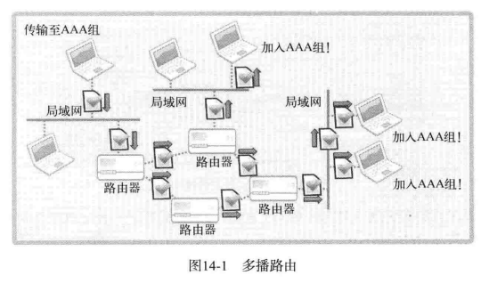
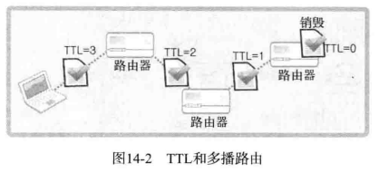
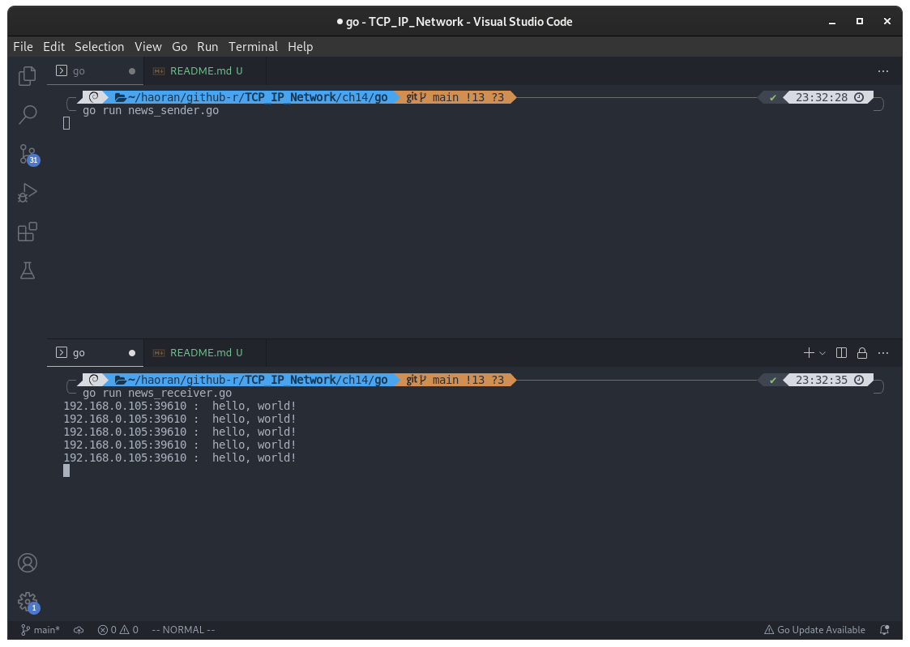

## 第 14 章 多播与广播

### 多播

多播（Multicast）方式的数据传输是基于 UDP 完成的。因此 ，与 UDP 服务器端/客户端的实现方式非常接近。区别在于，UDP 数据传输以单一目标进行，而多播数据同时传递到加入（注册）特定组的大量主机。换言之，采用多播方式时，可以同时向多个主机传递数据。

#### 多播的数据传输方式以及流量方面的优点

多播的数据传输特点可整理如下：

- 多播服务器端针对特定多播组，只发送 1 次数据。
- 即使只发送 1 次数据，但该组内的所有客户端都会接收数据
- 多播组数可以在 IP 地址范围内任意增加

多播组是 D 类IP地址（224.0.0.0~239.255.255.255），「加入多播组」可以理解为通过程序完成如下声明：

> 在 D 类IP地址中，我希望接收发往目标 239.234.218.234 的多播数据

多播是基于 UDP 完成的，也就是说，多播数据包的格式与 UDP 数据包相同。只是与一般的 UDP 数据包不同。向网络传递 1 个多播数据包时，路由器将复制该数据包并传递到多个主机。像这样，多播需要借助路由器完成。如图所示：



若通过 TCP 或 UDP 向 1000 个主机发送文件，则共需要传递 1000 次。但是此时如果用多播网络传输文件，则只需要发送一次。这时由 1000 台主机构成的网络中的路由器负责复制文件并传递到主机。就因为这种特性，多播主要用于「多媒体数据实时传输」。

另外，理论上可以完成多播通信，但是不少路由器并不支持多播，或即便支持也因网络拥堵问题故意阻断多播。因此，为了在不支持多播的路由器中完成多播通信，也会使用隧道（Tunneling）技术。

<!--
#### 路由（Routing）和 TTL（Time to Live，生存时间），以及加入组的办法

为了传递多播数据包，必须设置 TTL 。TTL 是 Time to Live的简写，是决定「数据包传递距离」的主要因素。TTL 用整数表示，并且每经过一个路由器就减一。TTL 变为 0 时，该数据包就无法再被传递，只能销毁。因此，TTL 的值设置过大将影响网络流量。当然，设置过小，也无法传递到目标。


-->

#### 实现多播 Sender 和 Receiver

多播中用「发送者」（以下称为 Sender） 和「接收者」（以下称为 Receiver）替代服务器端和客户端。顾名思义，此处的 Sender 是多播数据的发送主体，Receiver 是需要多播组加入过程的数据接收主体。下面是示例，示例的运行场景如下：

- Sender : 向 AAA 组广播（Broadcasting）信息；
- Receiver : 接收传递到 AAA 组的新闻信息；

下面是两个代码：

- [news_sender.go](./news_sender.go)
- [news_receiver.go](./news_receiver.go)

编译运行：

```
go run news_receiver.go
go run news_sender.go
```

结果：



因为发送方不停地发送信息，所以无论先运行发送方还是接收方都能接收到信息。

### 14.2 广播

广播（Broadcast）在「一次性向多个主机发送数据」这一点上与多播类似，但传输数据的范围有区别。多播即使在跨越不同网络的情况下，只要加入多播组就能接受数据。相反，广播只能向同一网络中的主机传输数据。

#### 14.2.1 广播的理解和实现方法

广播是向同一网络中的所有主机传输数据的方法。与多播相同，广播也是通过 UDP 来完成的。根据传输数据时使用的IP地址形式，广播分为以下两种：

- 直接广播（Directed Broadcast）
- 本地广播（Local Broadcast）

二者在实现上的差别主要在于IP地址。直接广播的IP地址中除了网络地址外，其余主机地址全部设置成 1。例如，希望向网络地址 192.12.34 中的所有主机传输数据时，可以向 192.12.34.255 传输。换言之，可以采取直接广播的方式向特定区域内所有主机传输数据。

反之，本地广播中使用的IP地址限定为 255.255.255.255 。例如，192.32.24 网络中的主机向 255.255.255.255 传输数据时，数据将传输到 192.32.24 网络中所有主机。

#### 实现广播数据的 Sender 和 Receiver

下面是广播数据的 Sender 和 Receiver的代码：

- [news_sender_brd.go](./news_sender_brd.go)
- [news_receiver_brd.go](./news_receiver_brd.go)

编译运行：

```
go run news_receiver_brd.go
go run news_sender_brd.go
```

结果：

