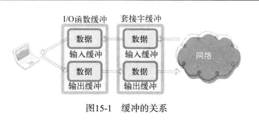
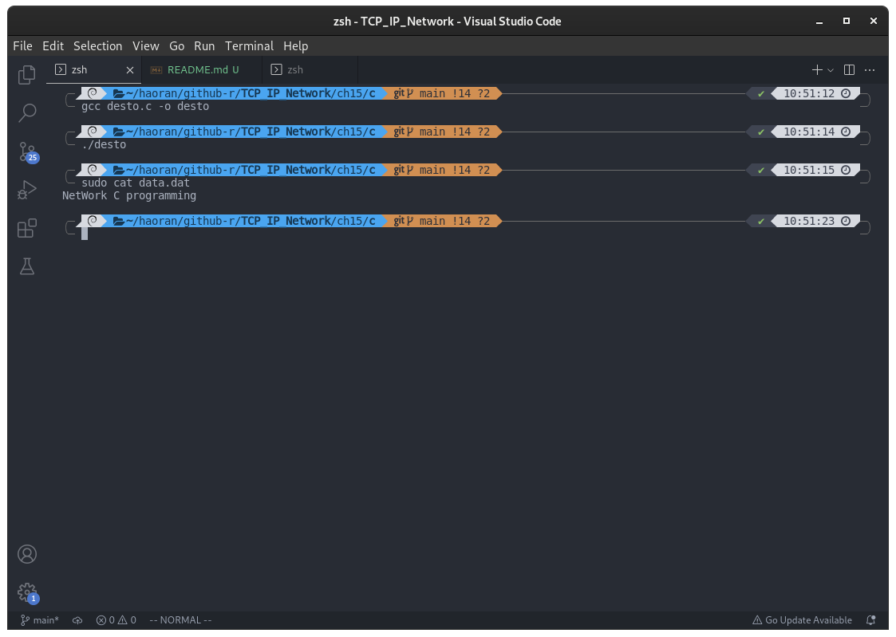

## 第 15 章 套接字和标准I/O

### 15.1 标准 I/O 的优点

#### 15.1.1 标准 I/O 函数的两个优点

下面是标准 I/O 函数的两个优点：

- 标准 I/O 函数具有良好的移植性
- 标准 I/O 函数可以利用缓冲提高性能

创建套接字时，操作系统会准备 I/O 缓冲。此缓冲在执行 TCP 协议时发挥着非常重要的作用。此时若使用标准 I/O 函数，将得到额外的缓冲支持。如下图：



假设使用 fputs 函数进行传输字符串 「Hello」时，首先将数据传递到标准 I/O 缓冲，然后将数据移动到套接字输出缓冲，最后将字符串发送到对方主机。

设置缓冲的主要目的是为了提高性能。从以下两点可以说明性能的提高：

- 传输的数据量；
- 数据向输出缓冲移动的次数；

比较 1 个字节的数据发送 10 次的情况和 10 个数据包发送 1 次的情况。发送数据时，数据包中含有头信息。头信与数据大小无关，是按照一定的格式填入的。假设头信息占 40 个字节，需要传输的数据量也存在较大区别：

- 1 个字节 10 次：40*10=400 字节
- 10个字节 1 次：40*1=40 字节。

#### 15.1.2 标准 I/O 函数和系统函数之间的性能对比

下面是利用系统函数的示例：

- [syscpy.c](./syscpy.c)

下面是使用标准 I/O 函数复制文件：

- [stdcpy.c](./stdcpy.c)

对于以上两个代码进行测试，明显基于标准 I/O 函数的代码跑的更快

#### 15.1.3 标准 I/O 函数的几个缺点

标准 I/O 函数存在以下几个缺点：

- 不容易进行双向通信
- 有时可能频繁调用 fflush 函数
- 需要以 FILE 结构体指针的形式返回文件描述符。

### 15.2 使用标准 I/O 函数

#### 15.2.1 利用 fdopen 函数转换为 FILE 结构体指针

函数原型如下：

```c
#include <stdio.h>
FILE *fdopen(int fildes, const char *mode);
/*
成功时返回转换的 FILE 结构体指针，失败时返回 NULL
fildes ： 需要转换的文件描述符
mode ： 将要创建的 FILE 结构体指针的模式信息
*/
```

以下为示例：

- [desto.c](./desto.c)

```c
#include <stdio.h>
#include <fcntl.h>

int main()
{
    FILE *fp;
    int fd = open("data.dat", O_WRONLY | O_CREAT | O_TRUNC); //创建文件并返回文件描述符
    if (fd == -1)
    {
        fputs("file open error", stdout);
        return -1;
    }
    fp = fdopen(fd, "w"); //返回 写 模式的 FILE 指针
    fputs("NetWork C programming \n", fp);
    fclose(fp);
    return 0;
}
```

编译运行：

```
gcc desto.c -o desto
./desto
cat data.dat
```

运行结果：



文件描述符转换为 FILE 指针，并可以通过该指针调用标准 I/O 函数。

#### 15.2.2 利用 fileno 函数转换为文件描述符

函数原型如下：

```c
#include <stdio.h>
int fileno(FILE *stream);
/*
成功时返回文件描述符，失败时返回 -1
*/
```

示例：

- [todes.c](./todes.c)

```c
#include <stdio.h>
#include <fcntl.h>

int main()
{
    FILE *fp;
    int fd = open("data.dat", O_WRONLY | O_CREAT | O_TRUNC);
    if (fd == -1)
    {
        fputs("file open error");
        return -1;
    }

    printf("First file descriptor : %d \n", fd);
    fp = fdopen(fd, "w"); //转成 file 指针
    fputs("TCP/IP SOCKET PROGRAMMING \n", fp);
    printf("Second file descriptor: %d \n", fileno(fp)); //转回文件描述符
    fclose(fp);
    return 0;
}
```

### 15.3 基于套接字的标准 I/O 函数使用

把第四章的回声客户端和回声服务端的内容改为基于标准 I/O 函数的数据交换形式。

代码如下：

- [echo_client.c](./echo_client.c)
- [echo_stdserv.c](./echo_stdserv.c)

编译运行：

```shell
gcc echo_client.c -o eclient
gcc echo_stdserv.c -o eserver
```

结果：


可以看出，运行结果和第四章相同，这是利用标准 I/O 实现的。