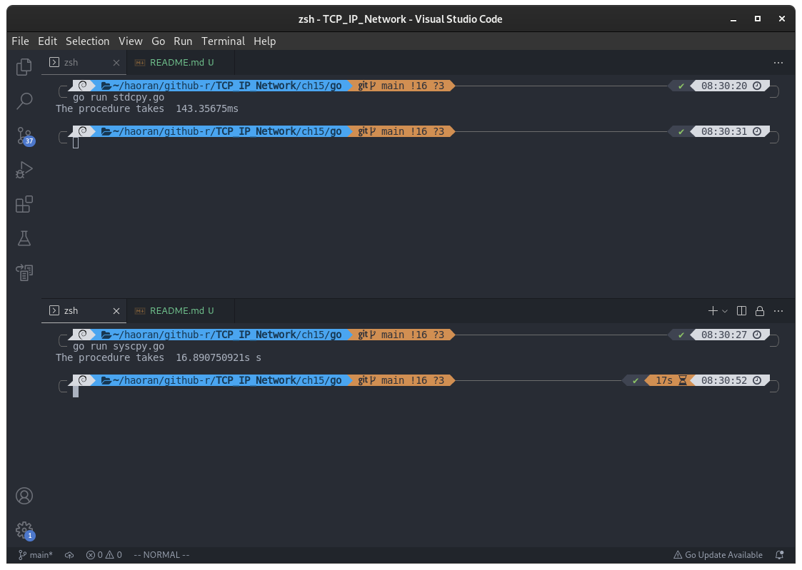
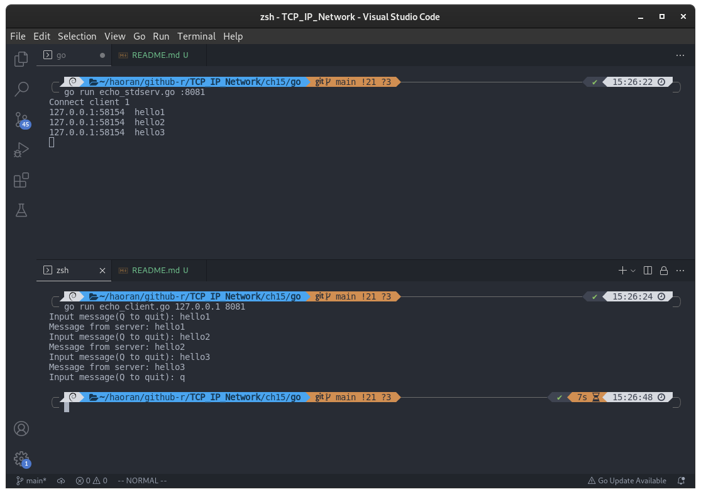

## 第 15 章 套接字和标准I/O

### 标准 I/O 的优点

#### 标准 I/O 函数和系统函数之间的性能对比

下面是利用系统函数的示例：

- [syscpy.go](./syscpy.go)

下面是使用标准 I/O 函数复制文件

- [stdcpy.go](./stdcpy.go)



对于以上两个代码进行测试，明显基于标准 I/O 函数的代码跑的更快。

### 使用标准 I/O 函数

#### 利用 os.NewFile 函数将文件描述符转换为 os.File 结构体指针

```go
import "os"
func os.NewFile(fd uintptr, name string) *os.File
/*
成功时返回转换的 os.File 结构体指针，如果传参为无效的文件描述符，返回 nil
fd: 需要转换的文件描述符
name: 文件名
*/
```

以下为示例：

- [desto.go](./desto.go)

```go
package main

import (
	"bufio"
	"fmt"
	"os"
	"syscall"
)

func main() {
	fd, _ := syscall.Open("data1.txt", os.O_WRONLY|os.O_CREATE|os.O_TRUNC, 0755)

	fp := os.NewFile(uintptr(fd), "") // 将文件描述符转换为 os.File 结构体指针

	writer := bufio.NewWriter(fp)
	writer.WriteString(fmt.Sprintf("NetWork Go programming %v", fp))
	writer.Flush()

	fp.Close()

	fmt.Println(fp)
}
```

#### 获取 os.File 结构体指针表示的文件描述符

```go
import "os"
func (*os.File).Fd() uintptr
```

示例：

- [todes.go](./todes.go)

```go
package main

import (
	"os"
	"syscall"
)

func main() {
	fp, _ := os.OpenFile("data2.txt", os.O_WRONLY|os.O_CREATE|os.O_TRUNC, 0755)

	fd := fp.Fd() // 获取 os.File 结构体指针表示的文件描述符

	syscall.Write(int(fd), []byte("TCP/IP SOCKET PROGRAMMING\n"))

	fp.Close()
}
```

### 基于套接字的标准 I/O 函数使用

把第四章的回声客户端和回声服务端的内容改为基于标准 I/O 函数的数据交换形式。

代码如下：

- [echo_client.go](./echo_client.go)
- [echo_stdserv.go](./echo_stdserv.go)

编译运行：

```shell
go run ./echo_stdserv.go :8081
go run ./echo_client.go 127.0.0.1 8081
```

结果：



可以看出，运行结果和第四章相同，这是利用标准 I/O 实现的。