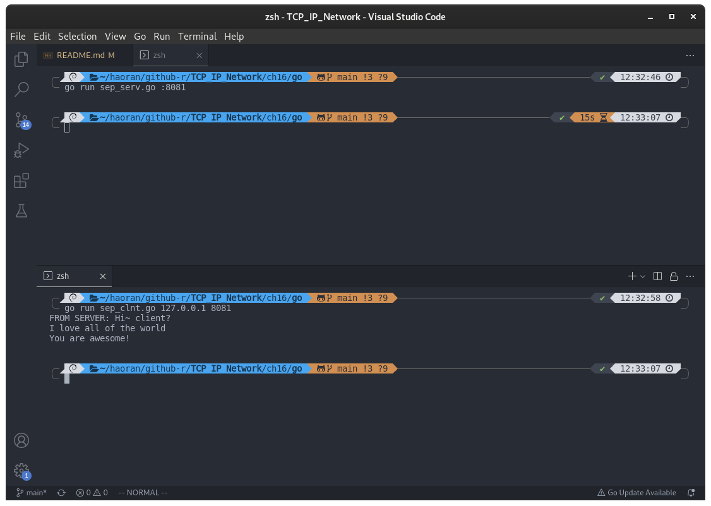
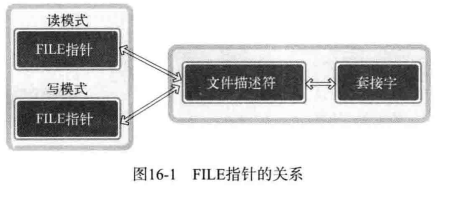
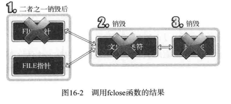
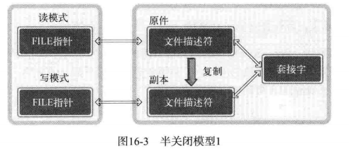
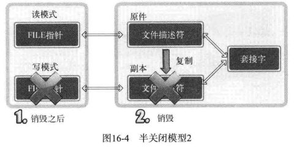
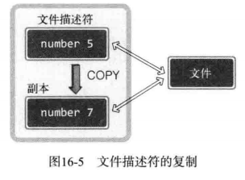
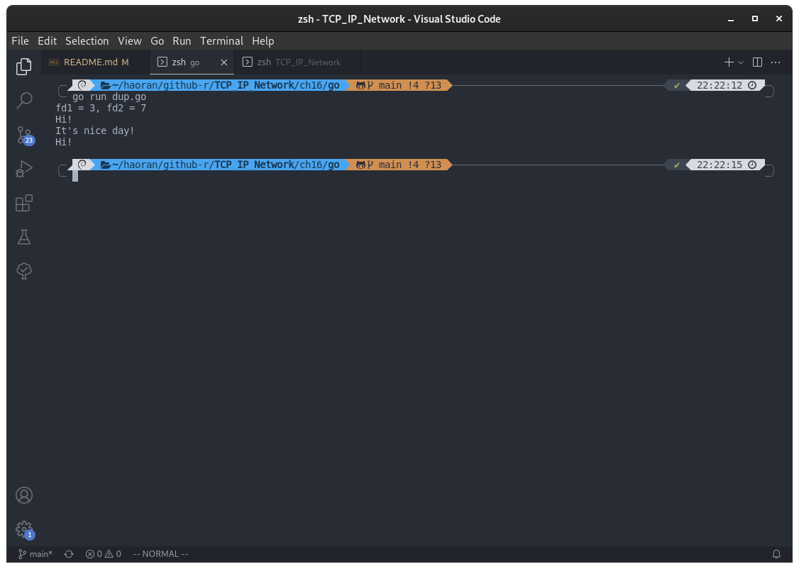
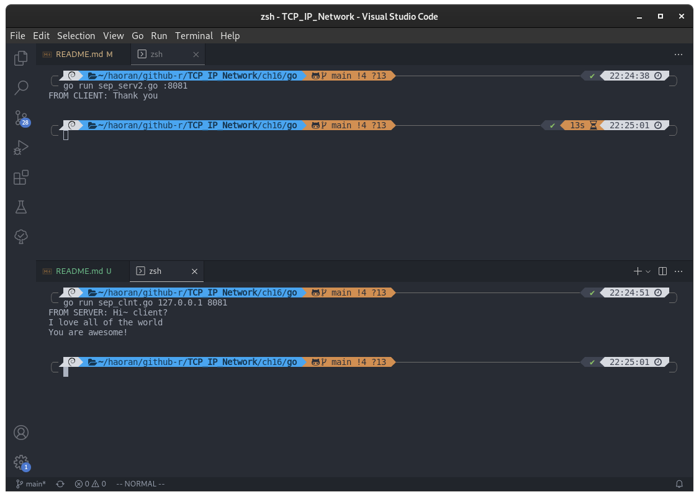

## 第 16 章 关于 I/O 流分离的其他内容

### 分离 I/O 流

「分离 I/O 流」是一种常用表达。有 I/O 工具可区分二者，无论采用哪种方法，都可以认为是分离了 I/O 流。

#### I/O 流分离

之前有两种分离方法：

- 第一种是第 10 章的「TCP I/O 过程」分离。 // TODO
- 第二种分离是在第 15 章。通过 bufio 包创建 reader 和 writer。我们分离了输入工具和输出工具，因此也可视为「流」的分离。下面是分离的理由。

#### 分离「流」的好处

首先是第 10 章「流」的分离目的：

- 通过分开输入过程（代码）和输出过程降低实现难度；
- 与输入无关的输出操作可以提高速度；

下面是第 15 章「流」分离的目的：

- 为了将 os.File 指针按读模式和写模式加以区分；
- 可以通过区分读写模式降低实现难度；
- 通过区分 I/O 缓冲提高缓冲性能；

#### 「流」分离带来的 EOF 问题

第 7 章介绍过 EOF 的传递方法和半关闭的必要性。有一个语句：

```c
shutdown(sock, SHUT_WR);
```

当时说过在 C 语言中调用 shutdown 函数的基于半关闭的 EOF 传递方法。第十章的 [echo_mpclient.c](../../ch10/c/echo_mpclient.c) 添加了半关闭的相关代码。但是还没有讲采用 bufio 的包创建的 reader 和 writer 怎么半关闭。那么是否是通过 Close() 方法关闭流呢？我们先试试

下面是服务端和客户端码：

- [sep_clnt.go](./sep_clnt.go)
- [sep_serv.go](./sep_serv.go)

编译运行：

```shell
go run ./sep_serv.go :8081
go run ./sep_clnt.go 127.0.0.1 8081
```

结果：



从运行结果可以看出，服务端最终没有收到客户端发送的信息。那么这是什么原因呢？

原因是：服务端代码的 `writefp.Close()` 这一句，完全关闭了套接字而不是半关闭。这才是这一章需要解决的问题。

### 文件描述符的的复制和半关闭

#### 终止「流」时无法半关闭原因

下面的图描述的是服务端代码中的两个 os.File 结构体指针、文件描述符和套接字中的关系。



从图中可以看到，两个指针都是基于同一文件描述符创建的。因此，针对于任何一个 os.File 指针调用 Close 方法都会关闭文件描述符，如图所示：



从图中看到，销毁套接字时再也无法进行数据交换。那如何进入可以进入但是无法输出的半关闭状态呢？如下图所示：



只需要创建 os.File 指针前先复制文件描述符即可。复制后另外创建一个文件描述符，然后利用各自的文件描述符生成读模式的 os.File 指针和写模式的 os.File 指针。这就为半关闭创造好了环境，因为套接字和文件描述符具有如下关系：

> 销毁所有文件描述符候才能销毁套接字

也就是说，针对写模式 os.File 指针调用 Close 方法时，只能销毁与该 os.File 指针相关的文件描述符，无法销毁套接字，如下图：



那么调用 Close 方法后还剩下 1 个文件描述符，因此没有销毁套接字。那此时的状态是否为半关闭状态？不是！只是准备好了进入半关闭状态，而不是已经进入了半关闭状态。仔细观察，还剩下一个文件描述符。而该文件描述符可以同时进行 I/O 。因此，不但没有发送 EOF ，而且仍然可以利用文件描述符进行输出。

#### 复制文件描述符

与调用 fork 操作不同，调用 fork 操作将复制整个进程，此处讨论的是同一进程内完成对完成描述符的复制。如图：



复制完成后，两个文件描述符都可以访问文件，但是编号不同。

#### syscall.Dup 和 syscall.Dup2

下面给出两个函数原型：

```c
import "syscall"
func syscall.Dup(oldfd int) (fd int, err error)
/*
返回复制的文件描述符（从未使用的文件描述符当中选取最小的文件描述符作为新的文件描述符）和可能出现的错误
oldfd : 需要复制的文件描述符
fd : 复制得到的文件描述符
*/
```

`syscall.Dup2(oldfd int, newfd int) (err error)` 函数使用一个描述符 newfd 去指向 oldfd 文件表项。 `syscall.Dup2(cfd1, cfd2)` 这样文件描述符 cfd2 就会指向 cfd1 的文件表项：

- [dup.c](./dup.c)

```go
package main

import (
	"fmt"
	"syscall"
)

func main() {
	str1 := "Hi! \n"
	str2 := "It's nice day! \n"

	/*
		文件描述符：
		1 - 标准输入
		2 - 标准输出
		3 - 标准错误
	*/
	cfd1, _ := syscall.Dup(1)
	var cfd2 int = 7
	syscall.Dup2(cfd1, cfd2) // 复制文件描述符 cfd1 得到 cfd2

	fmt.Printf("fd1 = %d, fd2 = %d \n", cfd1, cfd2)

	syscall.Write(cfd1, []byte(str1)) // 向 cfd1 和 cfd2 写入，等同于向标准输出写入
	syscall.Write(cfd2, []byte(str2))

	syscall.Close(cfd1)
	syscall.Close(cfd2)

	syscall.Write(1, []byte(str1))
	syscall.Close(1)
	syscall.Write(1, []byte(str2))
}
```

编译运行：

```
go run ./dup.go
```

结果：



#### 16.2.4 复制文件描述符后「流」的分离

下面更改 [sep_serv.go](./sep_serv.go) 可以使得让它正常工作，正常工作是指通过服务器的半关闭状态接收客户端最后发送的字符串。

下面是代码：

- [sep_serv2.go](./sep_serv2.go)

这个代码可以与 [sep_clnt.go](./sep_clnt.go) 配合起来食用，编译过程和上面一样，运行结果为：

