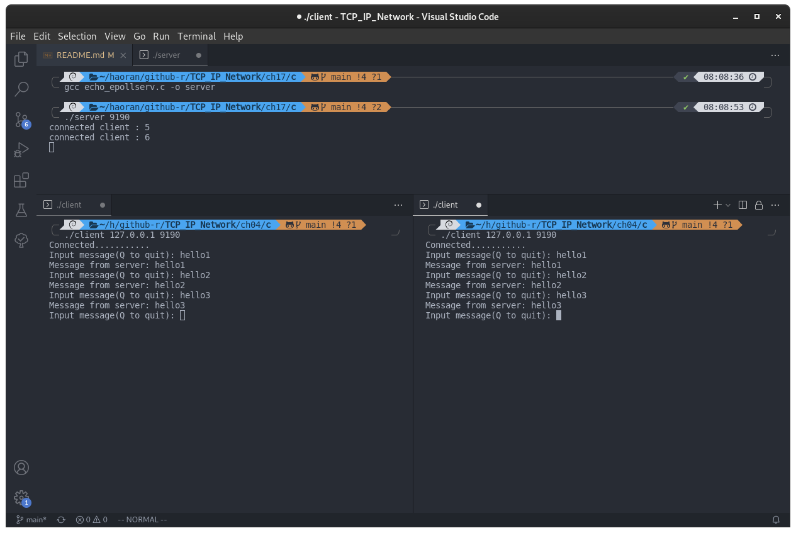
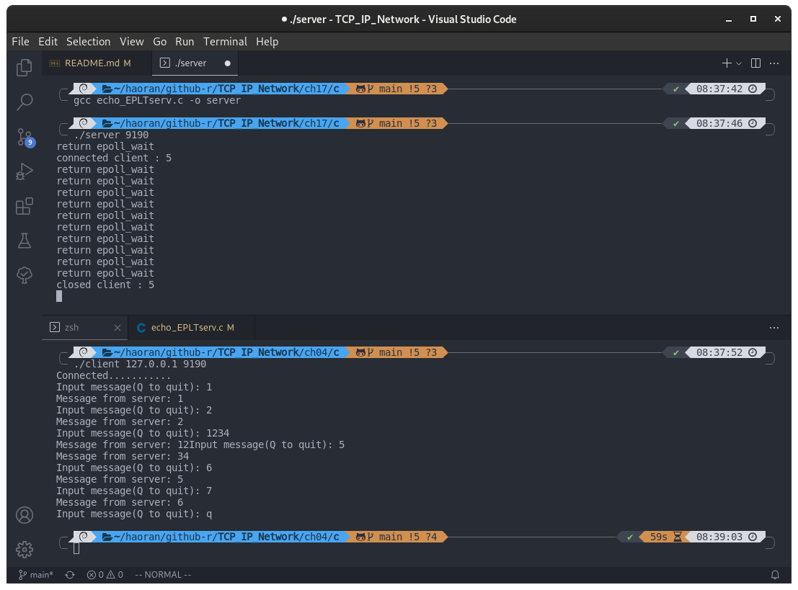
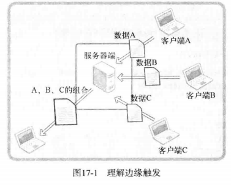

## 第 17 章 优于 select 的 epoll

### 17.1 epoll 理解及应用

select 复用方法由来已久，因此，利用该技术后，无论如何优化程序性能也无法同时介入上百个客户端。这种 select 方式并不适合以 web 服务器端开发为主流的现代开发环境，所以需要学习 Linux 环境下的 epoll。

#### 17.1.1 基于 select 的 I/O 复用技术速度慢的原因

第 12 章实现了基于 select 的 I/O 复用技术服务端，其中有不合理的设计如下：

- 调用 select 函数后常见的针对所有文件描述符的循环语句；
- 每次调用 select 函数时都需要向该函数传递监视对象信息；

上述两点可以从 [echo_selectserv.c](../../ch12/c/echo_selectserv.c) 得到确认，调用 select 函数后，并不是把发生变化的文件描述符单独集中在一起，而是通过作为监视对象的 fd_set 变量的变化，找出发生变化的文件描述符（54,56行），因此无法避免针对所有监视对象的循环语句。而且，作为监视对象的 fd_set 会发生变化，所以调用 select 函数前应该复制并保存原有信息，并在每次调用 select 函数时传递新的监视对象信息。

select 性能上最大的弱点是：每次传递监视对象信息，准确的说，select 是监视套接字变化的函数。而套接字是操作系统管理的，所以 select 函数要借助操作系统才能完成功能。select 函数的这一缺点可以通过如下方式弥补：

> 仅向操作系统传递一次监视对象，监视范围或内容发生变化时只通知发生变化的事项

这样就无需每次调用 select 函数时都想操作系统传递监视对象信息，但是前提操作系统支持这种处理方式。Linux 的支持方式是 epoll ，Windows 的支持方式是 IOCP。

#### 17.1.2 select 也有优点

select 的兼容性比较高，这样就可以支持很多的操作系统，不受平台的限制，使用 select 函数满足以下两个条件：

- 服务器接入者少；
- 程序应该具有兼容性；

#### 17.1.3 实现 epoll 时必要的函数和结构体

能够克服 select 函数缺点的 epoll 函数具有以下优点，这些优点正好与之前的 select 函数缺点相反。

- 无需编写以监视状态变化为目的的针对所有文件描述符的循环语句；
- 调用对应于 select 函数的 epoll_wait 函数时无需每次传递监视对象信息；

下面是 epoll 函数的功能：

- epoll_create：创建保存 epoll 文件描述符的空间；
- epoll_ctl：向空间注册并注销文件描述符；
- epoll_wait：与 select 函数类似，等待文件描述符发生变化；

select 函数中为了保存监视对象的文件描述符，直接声明了 fd_set 变量，但 epoll 方式下的操作系统负责保存监视对象文件描述符，因此需要向操作系统请求创建保存文件描述符的空间，此时用的函数就是 epoll_create 。

此外，为了添加和删除监视对象文件描述符，select 方式中需要 FD_SET、FD_CLR 函数。但在 epoll 方式中，通过 epoll_ctl 函数请求操作系统完成。最后，select 方式下调用 select 函数等待文件描述符的变化，而 epoll_wait 调用 epoll_wait 函数。还有，select 方式中通过 fd_set 变量查看监视对象的状态变化，而 epoll 方式通过如下结构体 epoll_event 将发生变化的文件描述符单独集中在一起。

```c
struct epoll_event
{
    __uint32_t events;
    epoll_data_t data;
};
typedef union epoll_data {
    void *ptr;
    int fd;
    __uint32_t u32;
    __uint64_t u64;
} epoll_data_t;

```

声明足够大的 epoll_event 结构体数组候，传递给 epoll_wait 函数时，发生变化的文件描述符信息将被填入数组。因此，无需像 select 函数那样针对所有文件描述符进行循环。

#### 17.1.4 epoll_create

epoll 是从 Linux 的 2.5.44 版内核开始引入的。通过以下命令可以查看 Linux 内核版本：

```shell
cat /proc/sys/kernel/osrelease
```

下面是 epoll_create 函数的原型：

```c
#include <sys/epoll.h>
int epoll_create(int size);
/*
成功时返回 epoll 的文件描述符，失败时返回 -1
size：epoll 实例的大小
*/
```

调用 epoll_create 函数时创建的文件描述符保存空间称为「epoll 例程」，但有些情况下名称不同，需要稍加注意。通过参数 size 传递的值决定 epoll 例程的大小，但该值只是向操作系统提出的建议。换言之，size 并不用来决定 epoll 的大小，而仅供操作系统参考。

> Linux 2.6.8 之后的内核将完全传入 epoll_create 函数的 size 函数，因此内核会根据情况调整 epoll 例程大小。但是本书程序并没有忽略 size

epoll_create 函数创建的资源与套接字相同，也由操作系统管理。因此，该函数和创建套接字的情况相同，也会返回文件描述符，也就是说返回的文件描述符主要用于区分 epoll 例程。需要终止时，与其他文件描述符相同，也要调用 close 函数

#### 17.1.5 epoll_ctl

生成例程后，应在其内部注册监视对象文件描述符，此时使用 epoll_ctl 函数。

```c
#include <sys/epoll.h>
int epoll_ctl(int epfd, int op, int fd, struct epoll_event *event);
/*
成功时返回 0 ，失败时返回 -1
epfd：用于注册监视对象的 epoll 例程的文件描述符
op：用于制定监视对象的添加、删除或更改等操作
fd：需要注册的监视对象文件描述符
event：监视对象的事件类型
*/
```

与其他 epoll 函数相比，该函数看起来有些复杂，但通过调用语句就很容易理解，假设按照如下形式调用 epoll_ctl 函数：

```CQL
epoll_ctl(A,EPOLL_CTL_ADD,B,C);
```

第二个参数 EPOLL_CTL_ADD 意味着「添加」，上述语句有如下意义：

> epoll  例程 A 中注册文件描述符 B ，主要目的是为了监视参数 C 中的事件

再介绍一个调用语句。

```c
epoll_ctl(A,EPOLL_CTL_DEL,B,NULL);
```

上述语句中第二个参数意味这「删除」，有以下含义：

> 从 epoll 例程 A 中删除文件描述符 B

从上述示例中可以看出，从监视对象中删除时，不需要监视类型，因此向第四个参数可以传递为 NULL

下面是第二个参数的含义：

- EPOLL_CTL_ADD：将文件描述符注册到 epoll 例程
- EPOLL_CTL_DEL：从 epoll 例程中删除文件描述符
- EPOLL_CTL_MOD：更改注册的文件描述符的关注事件发生情况

epoll_event 结构体用于保存事件的文件描述符结合。但也可以在 epoll 例程中注册文件描述符时，用于注册关注的事件。该函数中 epoll_event 结构体的定义并不显眼，因此通过掉英语剧说明该结构体在 epoll_ctl 函数中的应用。

```c
struct epoll_event event;
...
event.events=EPOLLIN;//发生需要读取数据的情况时
event.data.fd=sockfd;
epoll_ctl(epfd,EPOLL_CTL_ADD,sockfd,&event);
...
```

上述代码将 epfd 注册到 epoll 例程 epfd 中，并在需要读取数据的情况下产生相应事件。接下来给出 epoll_event 的成员 events 中可以保存的常量及所指的事件类型。

- EPOLLIN：需要读取数据的情况
- EPOLLOUT：输出缓冲为空，可以立即发送数据的情况
- EPOLLPRI：收到 OOB 数据的情况
- EPOLLRDHUP：断开连接或半关闭的情况，这在边缘触发方式下非常有用
- EPOLLERR：发生错误的情况
- EPOLLET：以边缘触发的方式得到事件通知
- EPOLLONESHOT：发生一次事件后，相应文件描述符不再收到事件通知。因此需要向 epoll_ctl 函数的第二个参数传递 EPOLL_CTL_MOD ，再次设置事件。

可通过位运算同事传递多个上述参数。

#### 17.1.6 epoll_wait

下面是函数原型：

```c
#include <sys/epoll.h>
int epoll_wait(int epfd, struct epoll_event *events, int maxevents, int timeout);
/*
成功时返回发生事件的文件描述符，失败时返回 -1
epfd : 表示事件发生监视范围的 epoll 例程的文件描述符
events : 保存发生事件的文件描述符集合的结构体地址值
maxevents : 第二个参数中可以保存的最大事件数
timeout : 以 1/1000 秒为单位的等待时间，传递 -1 时，一直等待直到发生事件
*/
```

该函数调用方式如下。需要注意的是，第二个参数所指缓冲需要动态分配。

```c
int event_cnt;
struct epoll_event *ep_events;
...
ep_events=malloc(sizeof(struct epoll_event)*EPOLL_SIZE);//EPOLL_SIZE是宏常量
...
event_cnt=epoll_wait(epfd,ep_events,EPOLL_SIZE,-1);
...
```

调用函数后，返回发生事件的文件描述符，同时在第二个参数指向的缓冲中保存发生事件的文件描述符集合。因此，无需像 select 一样插入针对所有文件描述符的循环。

#### 17.1.7 基于 epoll 的回声服务器端

下面是回声服务器端的代码（修改自第 12 章 [echo_selectserv.c](../../ch12/c/echo_selectserv.c)）：

- [echo_epollserv.c](./echo_epollserv.c)

编译运行：

```shell
gcc echo_epollserv.c -o serv
./serv 9190
```

运行结果：



可以看出运行结果和以前 select 实现的和 fork 实现的结果一样，都可以支持多客户端同时运行。

但是这里运用了 epoll 效率高于 select

总结一下 epoll 的流程：

1. epoll_create 创建一个保存 epoll 文件描述符的空间，可以没有参数；
2. 动态分配内存，给将要监视的 epoll_wait；
3. 利用 epoll_ctl 控制 添加 删除，监听事件；
4. 利用 epoll_wait 来获取改变的文件描述符，来执行程序；

select 和 epoll 的区别：

- 每次调用 select 函数都会向操作系统传递监视对象信息，浪费大量时间；
- epoll 仅向操作系统传递一次监视对象，监视范围或内容发生变化时只通知发生变化的事项；

### 17.2 条件触发和边缘触发

学习 epoll 时要了解条件触发（Level Trigger）和边缘触发（Edge Trigger）。

#### 17.2.1 条件触发和边缘触发的区别在于发生事件的时间点

**条件触发的特性**：

> 条件触发方式中，只要输入缓冲有数据就会一直通知该事件

例如，服务器端输入缓冲收到 50 字节数据时，服务器端操作系统将通知该事件（注册到发生变化的文件描述符）。但是服务器端读取 20 字节后还剩下 30 字节的情况下，仍会注册事件。也就是说，条件触发方式中，只要输入缓冲中还剩有数据，就将以事件方式再次注册。

**边缘触发特性**：

边缘触发中输入缓冲收到数据时仅注册 1 次该事件。即使输入缓冲中还留有数据，也不会再进行注册。

#### 17.2.2 掌握条件触发的事件特性

下面代码修改自 [echo_epollserv.c](./echo_epollserv.c) 。epoll 默认以条件触发的方式工作，因此可以通过该示例验证条件触发的特性。

- [echo_EPLTserv.c](./echo_EPLTserv.c)

上面的代码把调用 read 函数时使用的缓冲大小缩小到了 4 个字节，插入了验证 epoll_wait 调用次数的验证函数。减少缓冲大小是为了阻止服务器端一次性读取接收的数据。换言之，调用 read 函数后，输入缓冲中仍有数据要读取，而且会因此注册新的事件并从 epoll_wait 函数返回时将循环输出「return epoll_wait」字符串。

编译运行:

```shell
gcc echo_EPLTserv.c -o serv
./serv 9190
```

运行结果：



从结果可以看出，每当收到客户端数据时，都会注册该事件，并因此调用 epoll_wait 函数。

下面的代码是修改后的边缘触发方式的代码，仅仅是把上面的代码改为：

```c
event.events = EPOLLIN | EPOLLET;
```

代码：

- [echo_EDGEserv.c](./echo_EDGEserv.c)

编译运行：

```shell
gcc echo_EDGEserv.c -o serv
./serv 9190
```

结果：


从上面的例子看出，接收到客户端的消息时，只输出一次「return epoll_wait」字符串，这证明仅注册了一次事件。

**select 模型是以条件触发的方式工作的**。

#### 17.2.3 边缘触发的服务器端必知的两点

- 通过 errno 变量验证错误原因；
- 为了完成非阻塞（Non-blocking）I/O ，更改了套接字特性。

Linux 套接字相关函数一般通过 -1 通知发生了错误。虽然知道发生了错误，但仅凭这些内容无法得知产生错误的原因。因此，为了在发生错误的时候提额外的信息，Linux 声明了如下全局变量：

```c
int errno;
```

为了访问该变量，需要引入 `error.h` 头文件，因此此头文件有上述变量的 extren 声明。另外，每种函数发生错误时，保存在 errno 变量中的值都不同。

> read 函数发现输入缓冲中没有数据可读时返回 -1，同时在 errno 中保存 EAGAIN 常量

下面是 Linux 中提供的改变和更改文件属性的办法：

```c
#include <fcntl.h>
int fcntl(int fields, int cmd, ...);
/*
成功时返回 cmd 参数相关值，失败时返回 -1
filedes : 属性更改目标的文件描述符
cmd : 表示函数调用目的
*/
```

从上述声明可以看出 fcntl 有可变参数的形式。如果向第二个参数传递 F_GETFL ，可以获得第一个参数所指的文件描述符属性（int 型）。反之，如果传递 F_SETFL ，可以更改文件描述符属性。若希望将文件（套接字）改为非阻塞模式，需要如下  2 条语句。

```C
int flag = fcntl(fd,F_GETFL,0);
fcntl(fd,F_SETFL | O_NONBLOCK)
```

通过第一条语句，获取之前设置的属性信息，通过第二条语句在此基础上添加非阻塞 O_NONBLOCK 标志。调用 read/write 函数时，无论是否存在数据，都会形成非阻塞文件（套接字）。fcntl 函数的适用范围很广。

#### 17.2.4 实现边缘触发回声服务器端

通过 errno 确认错误的原因是：边缘触发方式中，接收数据仅注册一次该事件。

因为这种特点，一旦发生输入相关事件时，就应该读取输入缓冲中的全部数据。因此需要验证输入缓冲是否为空。

> read 函数返回 -1，变量 errno 中的值变成 EAGAIN 时，说明没有数据可读。

既然如此，为什么要将套接字变成非阻塞模式？边缘触发条件下，以阻塞方式工作的 read & write 函数有可能引起服务端的长时间停顿。因此，边缘触发方式中一定要采用非阻塞 read & write 函数。

下面是以边缘触发方式工作的回声服务端代码：

- [echo_EPETserv.c](./echo_EPETserv.c)

编译运行：

```shell
gcc echo_EPETserv.c -o serv
./serv
```

结果：


#### 17.2.5 条件触发和边缘触发孰优孰劣

边缘触发方式可以做到这点：

> 可以分离接收数据和处理数据的时间点！

下面是边缘触发的图



运行流程如下：

- 服务器端分别从 A B C 接收数据
- 服务器端按照  A B C 的顺序重新组合接收到的数据
- 组合的数据将发送给任意主机。

为了完成这个过程，如果可以按照如下流程运行，服务端的实现并不难：

- 客户端按照 A B C 的顺序连接服务器，并且按照次序向服务器发送数据
- 需要接收数据的客户端应在客户端 A B C 之前连接到服务器端并等待

但是实际情况中可能是下面这样：

- 客户端 C 和 B 正在向服务器发送数据，但是 A 并没有连接到服务器
- 客户端 A B C 乱序发送数据
- 服务端已经接收到数据，但是要接收数据的目标客户端并没有连接到服务器端。

因此，即使输入缓冲收到数据，服务器端也能决定读取和处理这些数据的时间点，这样就给服务器端的实现带来很大灵活性。