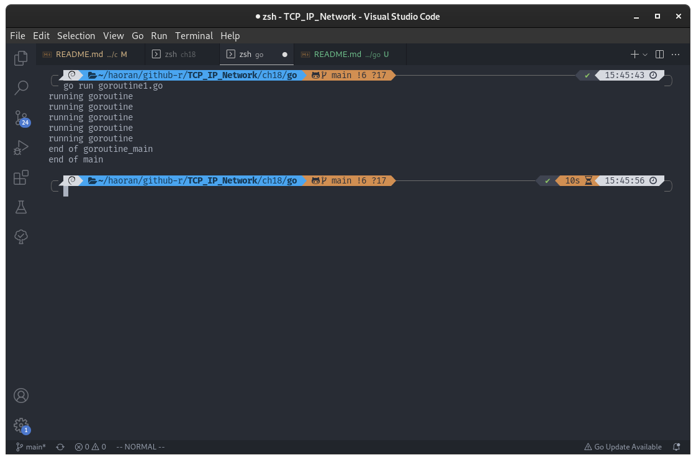
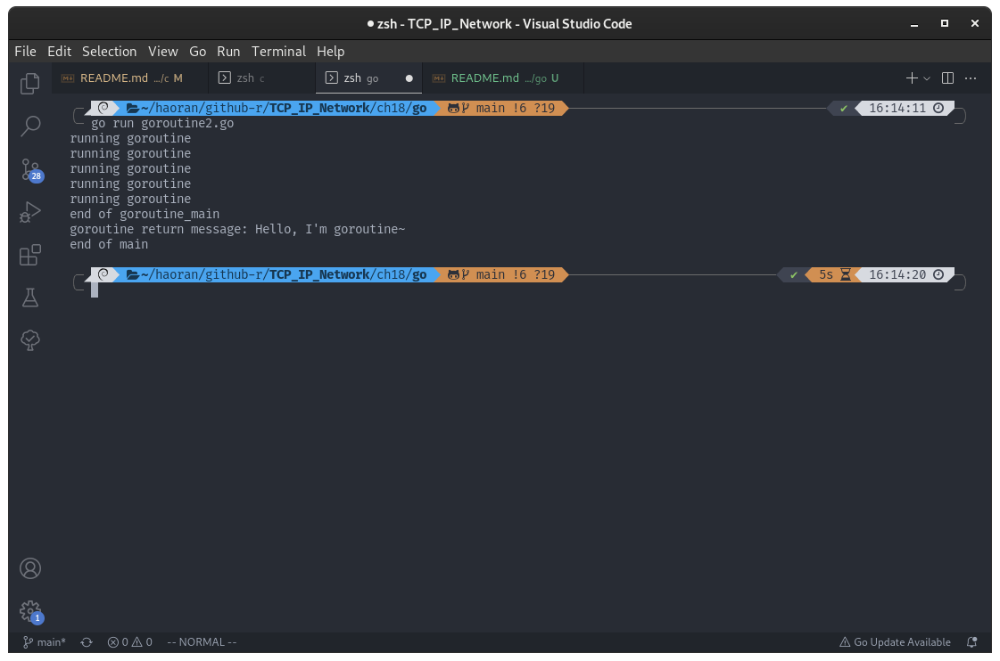
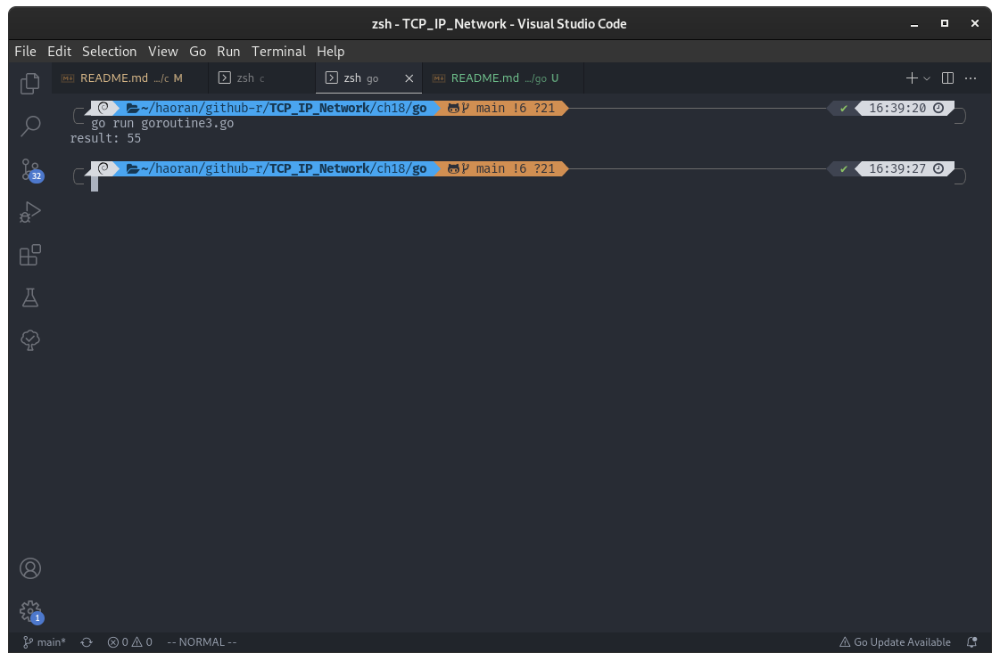
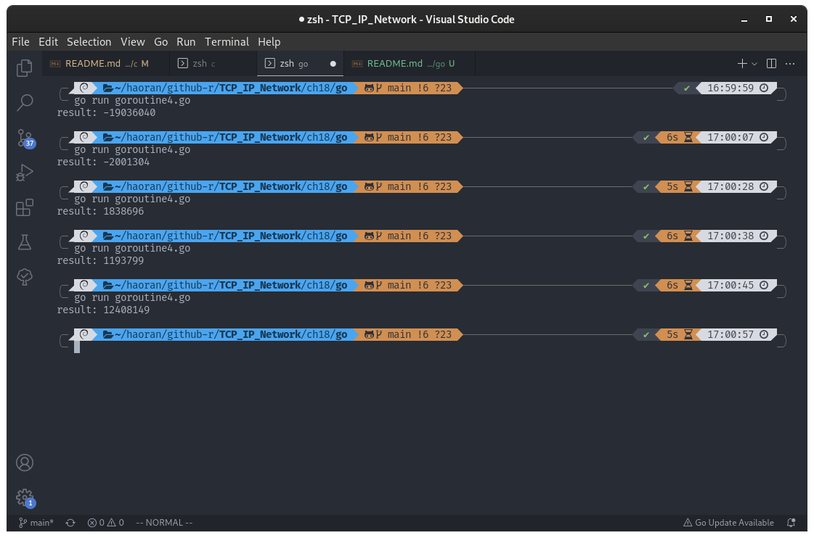
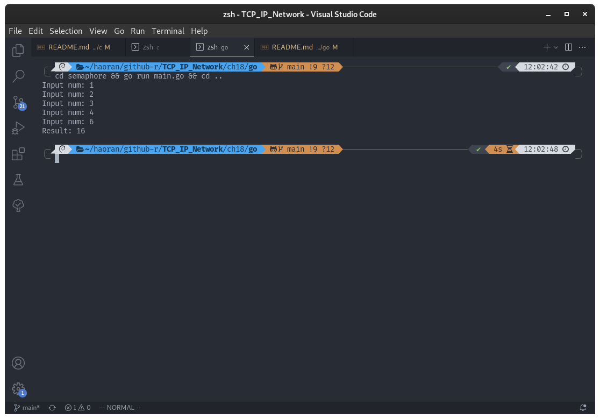
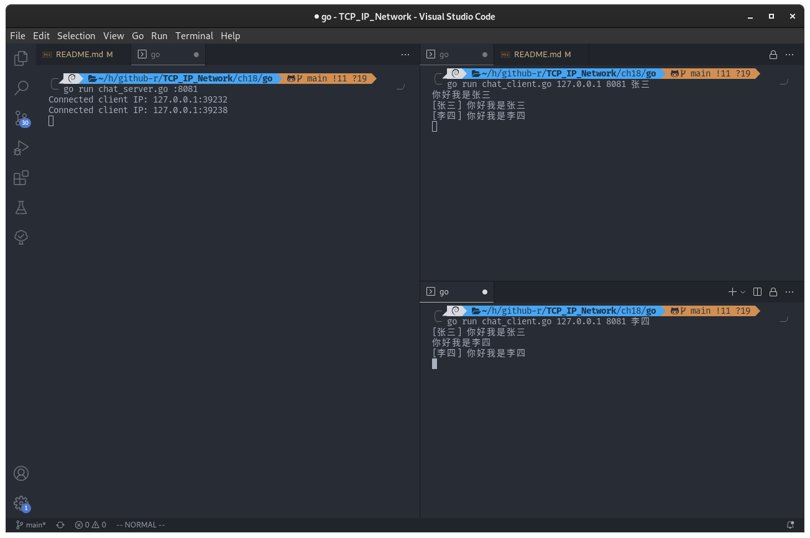

## 第 18 章 多协程服务器端的实现

### 理解协程的概念

#### 引入线程背景

第 10 章介绍了多进程服务端的实现方法。多进程模型与 select 和 epoll 相比的确有自身的优点，但同时也有问题。如前所述，创建（复制）进程的工作本身会给操作系统带来相当沉重的负担。而且，每个进程都具有独立的内存空间，所以进程间通信的实现难度也会随之提高。换言之，多进程的缺点可概括为：

- 创建进程的过程会带来一定的开销
- 为了完成进程间数据交换，需要特殊的 IPC 技术。

但是更大的缺点是下面的：

- 每秒少则 10 次，多则千次的「上下文切换」是创建进程的最大开销

只有一个 CPU 的系统是将时间分成多个微小的块后分配给了多个进程。为了分时使用 CPU ，需要「上下文切换」的过程。「上下文切换」是指运行程序前需要将相应进程信息读入内存，如果运行进程 A 后紧接着需要运行进程 B ，就应该将进程 A 相关信息移出内存，并读入进程 B 相关信息。这就是上下文切换。但是此时进程 A 的数据将被移动到硬盘，所以上下文切换要很长时间，即使通过优化加快速度，也会存在一定的局限。

为了保持多进程的优点，同时在一定程度上克服其缺点，人们引入的线程（Thread）的概念。这是为了将进程的各种劣势降至最低程度（不是直接消除）而设立的一种「轻量级进程」。线程比进程具有如下优点：

- 线程的创建和上下文切换比进程的创建和上下文切换更快
- 线程间交换数据无需特殊技术

#### 为什么引入协程

- 多线程可以共享同一块地址和所有可用数据，这是进程所不具备的，但带来的问题是多线程之间在进行数据同步的时候，就很有可能发生冲突（抢占式），所以往往需要添加锁来避免数据冲突（但加锁之后往往会影响程序的运行效率）；而协程因为存在于一个线程中，所以不存在写变量的冲突（非抢占式），**所以协程执行的效率比线程高很多**。
- **线程要比进程更加轻量**，创建一个线程要比创建一个进程快10 ~ 100倍，在切换的时候，由于进程是系统的多任务，进程的切换会带来大量的内存开销导致缺页中断，需要读取硬盘并加载到内存中；线程需要调用操作系统内核，涉及到从用户态切换到内核态，多个寄存器的刷新操作；而协程只有三个寄存器的值修改，只涉及到简单的现场保存和恢复。
- **性能方面**：如果多个线程都是 CPU 密集型任务，那么并不能获得性能上的增强，但如果存在着大量的计算和大量的 IO 处理，拥有多个线程能彼此重叠进行，从而加快程序的执行速度；协程也是类似的情况，可以把协程理解为在用户态下的线程，因为协程是非抢占式的，需要用户自己切换到其他协程，因此同一时间其实只有一个协程拥有运行权，协程的性能主要体现在 IO，协程的本质其实就是可以被暂停以及可以被恢复的函数，若一个 IO 操作比较消耗时间，CPU 可以换到另一个协程上运行，以免 CPU 时间在忙等中被白白浪费。

#### 为什么 Go 选择协程而不是线程

看看 Go 官网的说法：

> https://go.dev/doc/faq#goroutines
>
> Why goroutines instead of threads?
> 
> Goroutines are part of making concurrency easy to use. The idea, which has been around for a while, is to multiplex independently executing functions—coroutines—onto a set of threads. When a coroutine blocks, such as by calling a blocking system call, the run-time automatically moves other coroutines on the same operating system thread to a different, runnable thread so they won't be blocked. The programmer sees none of this, which is the point. The result, which we call goroutines, can be very cheap: they have little overhead beyond the memory for the stack, which is just a few kilobytes.
> 
> To make the stacks small, Go's run-time uses resizable, bounded stacks. A newly minted goroutine is given a few kilobytes, which is almost always enough. When it isn't, the run-time grows (and shrinks) the memory for storing the stack automatically, allowing many goroutines to live in a modest amount of memory. The CPU overhead averages about three cheap instructions per function call. It is practical to create hundreds of thousands of goroutines in the same address space. If goroutines were just threads, system resources would run out at a much smaller number. 

<!-- #### 协程、线程和进程的差异 -->

### 协程的创建及运行

#### 协程的创建和执行流程

要在一个协程中运行函数，直接在调用函数时添加关键字 `go` 就可以了：

- [goroutine1.go](./goroutine1.go)

```go
package main

import (
	"fmt"
	"time"
)

func main() {
	var goroutine_param int = 5 // 协程参数

	go goroutine_main(goroutine_param)

	time.Sleep(10 * time.Second) // 延迟主进程终止时间
	fmt.Println("end of main")
}

func goroutine_main(arg int) {
	var cnt int = arg

	for i := 0; i < cnt; i++ {
		time.Sleep(1 * time.Second)
		fmt.Println("running goroutine")
	}

	fmt.Println("end of goroutine_main")
}
```

编译运行：

```shell
go run goroutine1.go
```

运行结果：



可以看出，程序在主进程没有结束时，生成的协程每隔一秒输出一次 `running goroutine` ，但是如果主进程没有等待十秒，而是直接结束，这样也会强制结束协程，不论协程有没有运行完毕。

那是否意味着主进程必须每次都 sleep 来等待协程执行完毕？并不需要，官方在 sync 包中提供了 WaitGroup 类型来解决这个问题。其文档描述如下：

> A WaitGroup waits for a collection of goroutines to finish. The main goroutine calls Add to set the number of goroutines to wait for. Then each of the goroutines runs and calls Done when finished. At the same time, Wait can be used to block until all goroutines have finished.

使用方法可以总结为下面几点：

1. 创建一个 WaitGroup 实例，比如名称为：wg；
2. 调用 wg.Add(n)，其中 n 是等待的 goroutine 的数量；
3. 在每个 goroutine 运行的函数中执行 defer wg.Done()；
4. 调用 wg.Wait() 阻塞主逻辑；

- [goroutine2.go](./goroutine2.go)

```go
package main

import (
	"fmt"
	"sync"
	"time"
)

var msg chan string = make(chan string, 20)

func main() {
	var goroutine_param int = 5 // 协程参数
	var wg sync.WaitGroup
	wg.Add(1) // 主进程需要等待协程结束的数量

	go goroutine_main(goroutine_param, &wg)

	fmt.Printf("goroutine return message: %s\n", <-msg)

	// time.Sleep(10 * time.Second) // 延迟主进程终止时间
	wg.Wait() // 等待协程组结束
	fmt.Println("end of main")
}

func goroutine_main(arg int, wg *sync.WaitGroup) {
	defer wg.Done()

	var cnt int = arg

	for i := 0; i < cnt; i++ {
		time.Sleep(1 * time.Second)
		fmt.Println("running goroutine")
	}

	msg <- "Hello, I'm goroutine~"

	fmt.Println("end of goroutine_main")
}
```

编译运行：

```shell
go run goroutine2.go
```

运行结果：



协程输出了 5 次字符串，并且通过通道将值传递给主进程。

#### 可在临界区内调用的函数

在同步的程序设计中，临界区块（Critical section）指的是一个访问共享资源（例如：共享设备或是共享存储器）的程序片段，而这些共享资源有无法同时被多个协程访问的特性。

当有协程进入临界区块时，其他协程或是进程必须等待（例如：bounded waiting 等待法），有一些同步的机制必须在临界区块的进入点与离开点实现，以确保这些共享资源是被异或的使用，例如：semaphore。

只能被单一协程访问的设备，例如：打印机。

一个最简单的实现方法就是当协程（Goroutine）进入临界区块时，禁止改变处理器；在 uni-processor 系统上，可以用“禁止中断（CLI）”来完成，避免发生系统调用（System Call）导致的上下文交换（Context switching）；当离开临界区块时，处理器恢复原先的状态。

根据临界区是否引起问题，函数可以分为以下 2 类：

- 协程安全函数
- 非协程安全函数

协程安全函数被多个协程同时调用也不会发生问题。反之，非协程安全函数被同时调用时会引发问题。但这并非有关于临界区的讨论，协程安全的函数中同样可能存在临界区。只是在协程安全的函数中，同时被多个协程调用时可通过一些措施避免问题。

#### 工作（Worker）协程模型

下面的示例是计算从 1 到 10 的和，但并不是通过 main 函数进行运算，而是创建两个协程，其中一个协程计算 1 到 5 的和，另一个协程计算 6 到 10 的和，main 函数只负责输出运算结果。这种方式的协程模型称为「工作协程」。

- [goroutine3.go](./goroutine3.go)

```go
package main

import (
	"fmt"
	"sync"
)

var sum int = 0

func main() {
	var wg sync.WaitGroup
	wg.Add(2)

	range1 := []int{1, 5}
	range2 := []int{6, 10}

	go goroutine_summation(range1, &wg)
	go goroutine_summation(range2, &wg)

	wg.Wait()

	fmt.Printf("result: %d\n", sum)
}

func goroutine_summation(area []int, wg *sync.WaitGroup) {
	defer wg.Done()

	start := area[0]
	end := area[1]

	for start <= end {
		sum += start
		start++
	}
}
```

编译运行：

```shell
go run goroutine3.go
```

运行结果：



可以看出计算结果正确，两个协程都用了全局变量 sum，证明了 2 个协程共享保存全局变量的数据区。

但是本例子本身存在问题。存在临界区相关问题，可以从下面的代码看出，下面的代码和上面的代码相似，只是增加了发生临界区错误的可能性，即使在高配置系统环境下也容易产生的错误：

- [goroutine4.go](./goroutine4.go)

```go
package main

import (
	"fmt"
	"sync"
)

const NUM_GOROUTINE int = 100

var num int = 0

func main() {
	var wg sync.WaitGroup
	wg.Add(NUM_GOROUTINE)

	for i := 0; i < NUM_GOROUTINE; i++ {
		if i%2 == 1 {
			go goroutine_inc(&wg)
		} else {
			go goroutine_des(&wg)
		}
	}

	wg.Wait()

	fmt.Printf("result: %d\n", num)
}

func goroutine_inc(wg *sync.WaitGroup) {
	defer wg.Done()

	for i := 0; i < 50000000; i++ {
		num += 1
	}
}

func goroutine_des(wg *sync.WaitGroup) {
	defer wg.Done()

	for i := 0; i < 50000000; i++ {
		num -= 1
	}
}
```

编译运行：

```shell
go run goroutine4.go
```

结果：



从图上可以看出，每次运行的结果竟然不一样。理论上来说，上面代码的最后结果应该是 0 。原因暂时不得而知，但是可以肯定的是，这对于协程的应用是个大问题。

### 协程存在的问题和临界区

下面分析 [goroutine4.go](./goroutine4.go) 中产生问题的原因，并给出解决方案。

#### 多个协程访问同一变量是问题

[goroutine4.go](./goroutine4.go) 的问题如下：

> 2 个协程正在同时访问全局变量 num

任何内存空间，只要被同时访问，都有可能发生问题。

因此，协程访问变量 num 时应该阻止其他协程访问，直到协程 1 运算完成，这就是同步（Synchronization）。

#### 临界区位置

那么在刚才代码中的临界区位置是：

> 函数内同时运行多个协程时引发问题的多条语句构成的代码块

全局变量 num 不能视为临界区，因为他不是引起问题的语句，只是一个内存区域的声明。下面是刚才代码的两个 main 函数：

```go
func goroutine_inc(wg *sync.WaitGroup) {
	defer wg.Done()

	for i := 0; i < 50000000; i++ {
		num += 1 // 临界区
	}
}

func goroutine_des(wg *sync.WaitGroup) {
	defer wg.Done()

	for i := 0; i < 50000000; i++ {
		num -= 1 // 临界区
	}
}
```

由上述代码可知，临界区并非 num 本身，而是访问 num 的两条语句，这两条语句可能由多个协程同时运行，也是引起这个问题的直接原因。产生问题的原因可以分为以下三种情况：

- 2 个协程同时执行 goroutine_inc 函数
- 2 个协程同时执行 goroutine_des 函数
- 2 个协程分别执行 goroutine_inc 和 goroutine_des 函数

比如发生以下情况：

> 协程 1 执行 goroutine_inc 的 num+=1 语句的同时，协程 2 执行 goroutine_des 函数的 num-=1 语句

也就是说，两条不同的语句由不同的协程执行时，也有可能构成临界区。前提是这 2 条语句访问同一内存空间。

### 协程同步

前面讨论了协程中存在的问题，下面就是解决方法，协程同步。

#### 同步的两面性

协程同步用于解决协程访问顺序引发的问题。需要同步的情况可以从如下两方面考虑：

- 同时访问同一内存空间时发生的情况；
- 需要指定访问同一内存空间的协程顺序的情况；

情况一之前已经解释过，下面讨论情况二。这是「控制协程执行的顺序」的相关内容。假设有 A B 两个协程，协程 A 负责向指定的内存空间内写入数据，协程 B 负责取走该数据。所以这是有顺序的，不按照顺序就可能发生问题。所以这种也需要进行同步。

#### 互斥量

互斥锁（英语：英语：Mutual exclusion，缩写 Mutex）是一种用于多协程编程中，防止两条协程同时对同一公共资源（比如全域变量）进行读写的机制。该目的通过将代码切片成一个一个的临界区域（critical section）达成。临界区域指的是一块对公共资源进行访问的代码，并非一种机制或是算法。一个程序、进程、线程、协程可以拥有多个临界区域，但是并不一定会应用互斥锁。

通俗的说就互斥量就是一把优秀的锁，当临界区被占据的时候就上锁，等占用完毕然后再放开。

互斥锁 Mutex 就提供两个方法 Lock 和 Unlock：进入临界区之前调用 Lock 方法，退出临界区的时候调用 Unlock 方法 ：

```go
func (m *Mutex) Lock()
func (m *Mutex) Unlock()
```

当一个 goroutine 通过调用 Lock 方法获得了这个锁的拥有权后， 其它请求锁的 goroutine 就会阻塞在 Lock 方法的调用上，直到锁被释放并且自己获取到了这个锁的拥有权。

下面是利用互斥量解决示例 [goroutine4.go](./goroutine4.go)：

- [mutex.go](./mutex.go)

```go
package main

import (
	"fmt"
	"sync"
)

const NUM_THREAD int = 100

var num int = 0
var mutex sync.Mutex

func main() {
	var wg sync.WaitGroup
	wg.Add(NUM_THREAD)

	for i := 0; i < NUM_THREAD; i++ {
		if i%2 == 1 {
			go goroutine_inc(&wg)
		} else {
			go goroutine_des(&wg)
		}
	}

	wg.Wait()

	fmt.Printf("result: %d\n", num)
}

func goroutine_inc(wg *sync.WaitGroup) {
	defer wg.Done()

	mutex.Lock() // 上锁
	for i := 0; i < 50000000; i++ {
		num += 1
	}
	mutex.Unlock() // 解锁
}

func goroutine_des(wg *sync.WaitGroup) {
	defer wg.Done()

	mutex.Lock()
	for i := 0; i < 50000000; i++ {
		num -= 1
	}
	mutex.Unlock()
}
```

编译运行：

```shell
go run mutex.go
```

运行结果：


从运行结果可以看出，通过互斥量机制得出了正确的运行结果。

在代码中：

```go
func goroutine_inc(wg *sync.WaitGroup) {
	defer wg.Done()

	mutex.Lock() // 上锁
	for i := 0; i < 50000000; i++ {
		num += 1
	}
	mutex.Unlock() // 解锁
}
```

以上代码的临界区划分范围较大，但这是考虑如下优点所做的决定:

> 最大限度减少互斥量 Lock Unlock 函数的调用次数

#### 信号量

信号量（英语：Semaphore）又称为信号标，是一个同步对象，用于保持在 0 至指定最大值之间的一个计数值。当协程完成一次对该 semaphore 对象的等待（wait）时，该计数值减一；当协程完成一次对 semaphore 对象的释放（release）时，计数值加一。当计数值为 0，则协程等待该 semaphore 对象不再能成功直至该 semaphore 对象变成 signaled 状态。semaphore 对象的计数值大于 0，为 signaled 状态；计数值等于 0，为 nonsignaled 状态.

semaphore 对象适用于控制一个仅支持有限个用户的共享资源，是一种不需要使用忙碌等待（busy waiting）的方法。

信号量的概念是由荷兰计算机科学家艾兹赫尔·戴克斯特拉（Edsger W. Dijkstra）发明的，广泛的应用于不同的操作系统中。在系统中，给予每一个进程一个信号量，代表每个进程当前的状态，未得到控制权的进程会在特定地方被强迫停下来，等待可以继续进行的信号到来。如果信号量是一个任意的整数，通常被称为计数信号量（Counting semaphore），或一般信号量（general semaphore）；如果信号量只有二进制的0或1，称为二进制信号量（binary semaphore）。在linux系统中，二进制信号量（binary semaphore）又称互斥锁（Mutex）。

下面介绍 Go 语言中的信号量，在互斥量的基础上，很容易理解信号量。此处只涉及利用「二进制信号量」（只用 0 和 1）完成「控制协程顺序」为中心的同步方法。下面是 Go 语言源码中几个关于操作信号量的函数：

```go
func runtime_Semacquire(s *uint32)
func runtime_SemacquireMutex(s *uint32, lifo bool, skipframes int)
func runtime_Semrelease(s *uint32, handoff bool, skipframes int)
```

这几个函数就是信号量的 PV 操作，不过他们都是给 Go 内部使用的，虽然官方有 Semaphore 的扩展包（golang.org/x/sync），不过它的功能并不适用这里，我们自己封装一个二进制信号量：

- [semaphore.go](./semaphore/semaphore/semaphore.go)

```go
// https://www.jianshu.com/p/df65ed75d694
type Semaphore struct {
	permits int      // 许可数量
	channel chan int // 通道
}

/* 创建信号量 */
func NewSemaphore(permits int) *Semaphore {
	return &Semaphore{channel: make(chan int, permits), permits: permits}
}

/* 获取许可 */
func (s *Semaphore) Acquire() {
	s.channel <- 0
}

/* 释放许可 */
func (s *Semaphore) Release() {
	<-s.channel
}

/* 尝试获取许可 */
func (s *Semaphore) TryAcquire() bool {
	select {
	case s.channel <- 0:
		return true
	default:
		return false
	}
}

/* 尝试指定时间内获取许可 */
func (s *Semaphore) TryAcquireOnTime(timeout time.Duration) bool {
	for {
		select {
		case s.channel <- 0:
			return true
		case <-time.After(timeout):
			return false
		}
	}
}

/* 当前可用的许可数 */
func (s *Semaphore) AvailablePermits() int {
	return s.permits - len(s.channel)
}
```

调用 NewSemaphore 方法为信号量写入「信号量值」（Semaphore Value）整数。该值在调用 Acquire 方法时增加 1 ，调用 Release 方式时减 1。但信号量的值不能小于 0 ，因此，在信号量为 0 的情况下调用 Release 方法时，调用的协程将进入阻塞状态（因为方法未返回）。当然，此时如果有其他协程调用 Release 函数，信号量的值将变为 1 ，而原本阻塞的协程可以将该信号重新减为 0 并跳出阻塞状态。实际上就是通过这种特性完成临界区的同步操作，可以通过如下形式同步临界区（假设信号量的初始值为 1）：

```go
sem.Release() // 信号量变为 0
// 临界区的开始
// ...
// 临界区的结束
sem.Acquire() // 信号量变为 1
```

上述代码结构中，调用 Release 方法进入临界区的协程在调用 Acquire 方法前不允许其他协程进入临界区。信号量的值在 0 和  1 之间跳转，因此，具有这种特性的机制称为「二进制信号量」。接下来的代码是信号量机制的代码。下面代码并非是同时访问的同步，而是关于控制访问顺序的同步，该场景为：

> 协程  A 从用户输入得到值后存入全局变量 num ，此时协程 B 将取走该值并累加。该过程一共进行 5 次，完成后输出总和并退出程序。

下面是代码：

- [semaphore/main.go](./semaphore/main.go)

```go
package main

import (
	"fmt"
	"sync"

	"github.com/haoran-mc/TCP_IP_Network/ch18/go/semaphore/semaphore"
	// "golang.org/x/sync/semaphore"
)

var sem_one = semaphore.NewSemaphore(1)
var sem_two = semaphore.NewSemaphore(1)
var num int

func main() {
	sem_two.Acquire() // 信号量 sem_two 的初始值设置为 1，为了和 C 代码中保持一致

	var wg sync.WaitGroup
	wg.Add(2)

	go read(&wg)
	go accu(&wg)

	wg.Wait()
}

func read(wg *sync.WaitGroup) {
	defer wg.Done()

	for i := 0; i < 5; i++ {
		fmt.Print("Input num: ")

		sem_two.Release()
		fmt.Scanf("%d", &num)
		sem_one.Acquire()
	}
}

func accu(wg *sync.WaitGroup) {
	defer wg.Done()

	sum := 0

	for i := 0; i < 5; i++ {
		sem_one.Release()
		sum += num
		sem_two.Acquire()
	}

	fmt.Printf("Result: %d\n", sum)
}
```

编译运行：

```shell
cd semaphore && go run main.go && cd ..
```

结果：



### 协程的销毁和多协程并发服务器端的实现

先介绍协程的销毁，然后再介绍多协程服务端

#### 协程的销毁

- 子协程销毁，孙协程...继续执行；
- 主协程销毁，子协程、孙协程...都将被销毁；

手动销毁可以调用 runtime.Goexit()。

#### 多协程并发服务器端的实现

下面是多个客户端之间可以交换信息的简单聊天程序。

- [chat_server.go](./chat_server.go)
- [chat_client.go](./chat_client.go)

上面的服务端示例中，需要掌握临界区的构成，访问全局变量 clnt_cnt 和数组 clnt_socks 的代码将构成临界区，添加和删除客户端时，变量 clnt_cnt 和数组 clnt_socks 将同时发生变化。因此下列情形会导致数据不一致，从而引发错误：

- 协程 A 从数组 clnt_socks 中删除套接字信息，同时协程 B 读取 clnt_cnt 变量；
- 协程 A 读取变量 clnt_cnt，同时协程 B 将套接字信息添加到 clnt_socks 数组；

编译运行：

```shell
go run chat_server.go :8081
go run chat_client.go 127.0.0.1 8081 张三
go run chat_client.go 127.0.0.1 8081 李四
```

结果：

